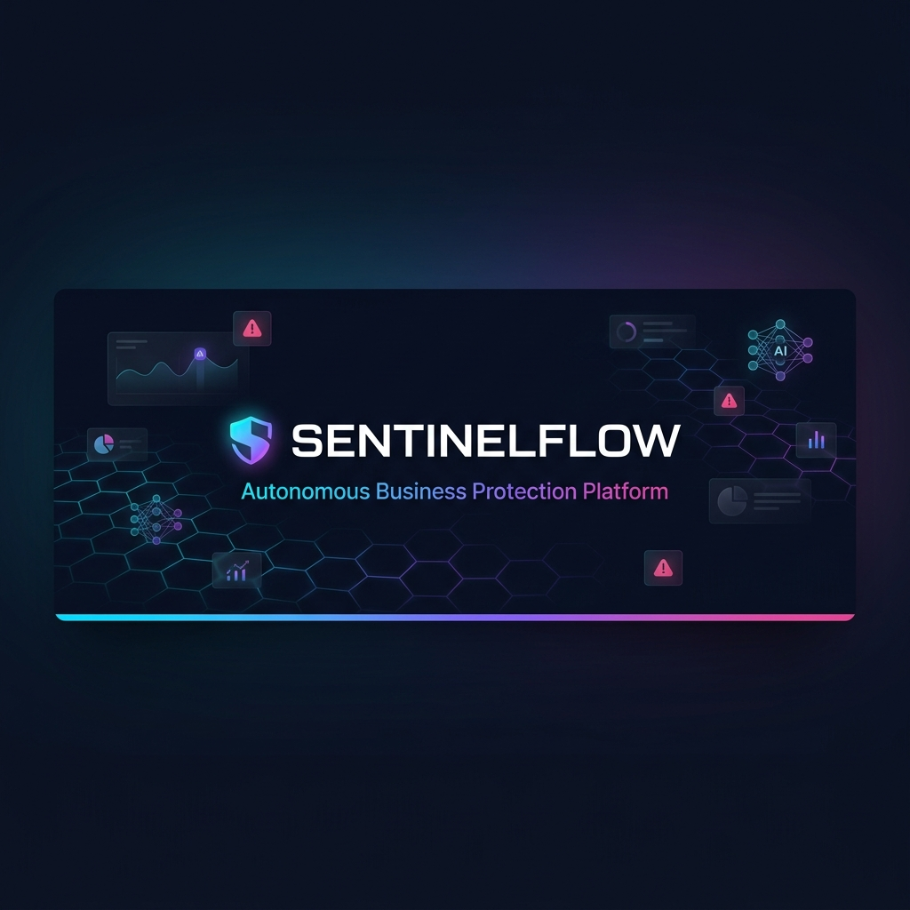
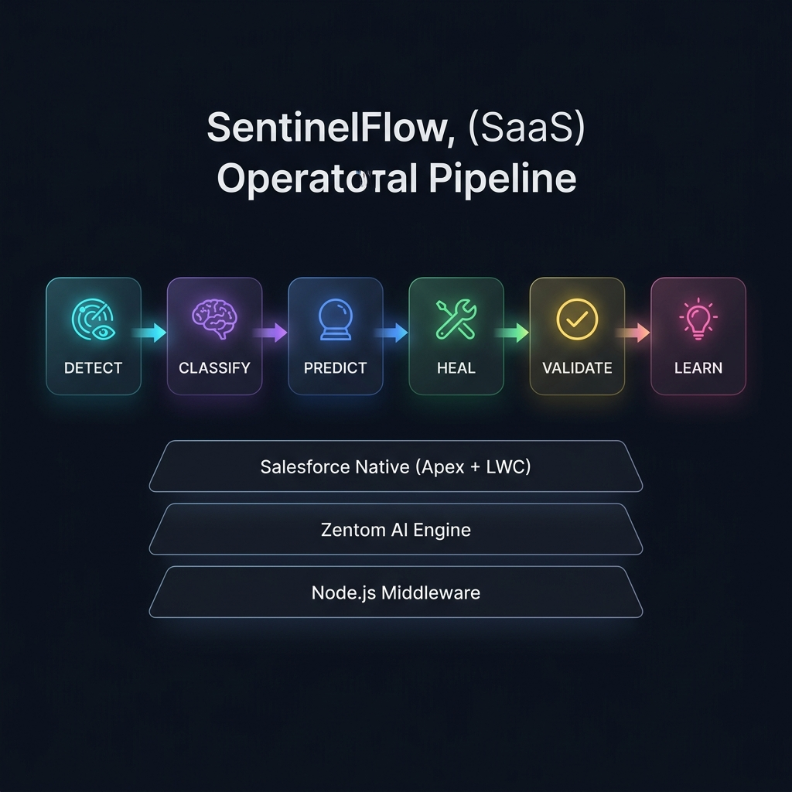
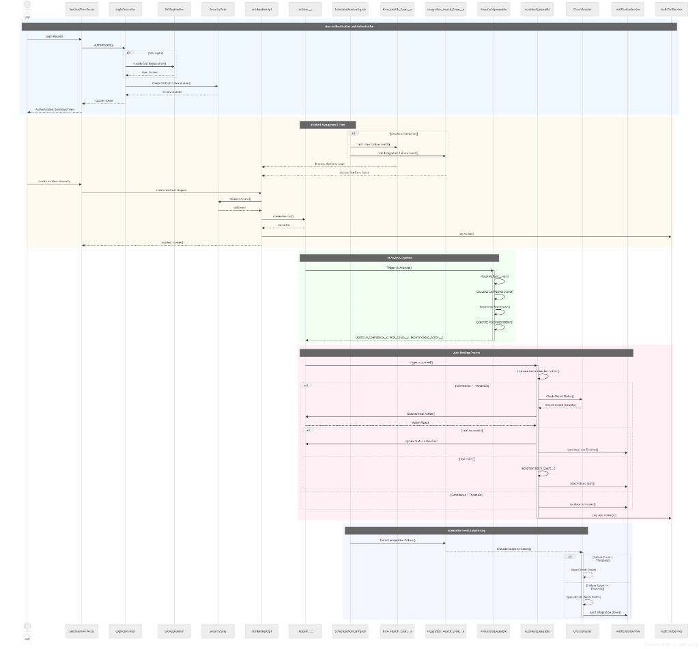
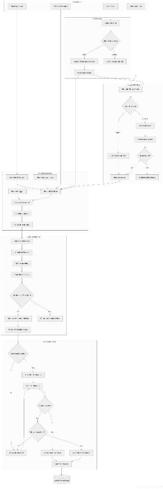
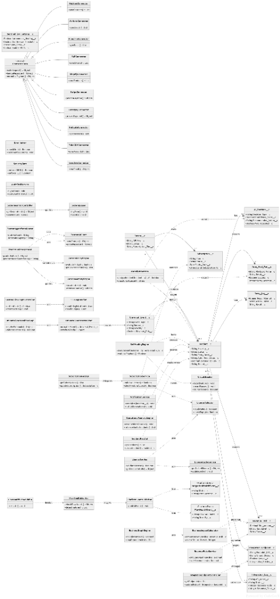

<p align="center">
  
</p>

<h1 align="center">SentinelFlow</h1>

<p align="center">
  <strong>The Autonomous Business Protection Platform for Salesforce</strong><br/>
  <em>Detect · Classify · Predict · Heal · Learn — all without human intervention.</em>
</p>

<p align="center">
  <a href="https://github.com/AstroSoft/SentinelFlow/releases"></a>
  <a href="https://appexchange.salesforce.com"></a>
  <a href="#"></a>
  <a href="#"></a>
  <a href="#"></a>
  <a href="https://opensource.org/licenses/MIT"></a>
</p>

<p align="center">
  <a href="#-quick-start">Quick Start</a> •
  <a href="#-features">Features</a> •
  <a href="#%EF%B8%8F-architecture">Architecture</a> •
  <a href="#-demo">Demo</a> •
  <a href="#-documentation">Docs</a> •
  <a href="#-contributing">Contributing</a>
</p>

---

## 🔥 The Problem

Enterprise Salesforce teams wake up to disasters. A payment integration silently fails at 2 AM. By 6 AM, **$40,000 in orders are stuck**. By 9 AM, the engineering team is scrambling through logs. By noon, there's a customer escalation.

> *"We found out Stripe stopped syncing because a customer called us. $47,000 in unprocessed orders."*
> — VP of Operations, Series B SaaS Company

**Traditional monitoring tools alert you *something broke*.**  
**SentinelFlow tells you *why*, *what to do*, and *how much revenue is at risk* — then fixes it autonomously.**

---

## ✨ Features

<table>
<tr>
<td width="50%">

### 🛡️ AI Incident Detection
Real-time monitoring across integrations, Apex jobs, Flows, and API limits — 24/7. Auto-refreshes every **10 seconds** with zero polling overhead.

### 🧠 Zentom AI Classification
Root cause analysis + severity scoring in **< 10 seconds**. Structured output: cause, recommended action, confidence score. Powered by the Zentom GenAI v1 engine.

### 🔮 Predictive Risk Scoring
Failure probability scoring **12–72 hours in advance**. Never be surprised by a P1 again.

</td>
<td width="50%">

### ⚡ Auto-Heal Orchestrator
Autonomous runbook execution with validation. OAuth refresh, batch retry, Flow restart — resolved before your team wakes up. **MTTR: 18 seconds**.

### 🧬 Operational Memory
Every incident is indexed and remembered — forever. Semantic matching against thousands of known fixes with **96% success rate**.

### 💰 Revenue Pulse Engine
Real-time revenue-at-risk per incident. Formatted intelligently (`$84K`, `$1.2M`). Business impact visibility that CxOs actually use.

</td>
</tr>
</table>

---

## 🏗️ Architecture

<p align="center">
  
</p>

SentinelFlow operates as a **closed-loop autonomous system** with six intelligence layers:

```
  ┌──────────┐    ┌───────────┐    ┌──────────┐    ┌────────┐    ┌──────────┐    ┌─────────┐
  │  DETECT  │───▶│  CLASSIFY │───▶│  PREDICT │───▶│  HEAL  │───▶│ VALIDATE │───▶│  LEARN  │
  └──────────┘    └───────────┘    └──────────┘    └────────┘    └──────────┘    └─────────┘
   Real-time       AI Root Cause    Risk Scoring    Auto-Heal     Recovery        Memory
   Events          + Severity       12-72h ahead    Runbooks      Verification    Indexing
```

### Technology Stack

| Layer | Technology | Purpose |
|:------|:-----------|:--------|
| **Frontend** | Lightning Web Components (28 components) | Experience Cloud portal, dashboards, copilot |
| **Backend** | Apex (137+ classes) | Business logic, security gates, orchestration |
| **AI Engine** | Zentom GenAI v1 | Classification, root cause, predictions |
| **Memory** | Vector Database (Operational Memory Engine) | Semantic incident matching & retrieval |
| **Middleware** | Node.js + Express | External API bridge, webhook ingestion |
| **Events** | Platform Events + Universal Event Layer | Real-time streaming architecture |
| **Security** | SecurityGate + FLS/CRUD enforcement | AppExchange-grade security compliance |

### Data Model

```
Incident__c ──────────── Integration_Log__c
    │                         │
    ├── AI_Decision__c        ├── Retry_Log__c
    ├── Auto_Heal_Run__c      └── Integration_Endpoint__c
    ├── Revenue_Risk__c
    ├── Audit_Trail__c        Flow_Health__c
    └── Universal_Event__c    Zentom_Replay_Log__c
                              SLA_Policy__c
                              Subscription__c
```

### Sequence Diagram — End-to-End Platform Flow

The complete interaction flow from user authentication through incident detection, AI analysis, auto-healing, and integration health monitoring:

<p align="center">
  
</p>

<details>
<summary><strong>📖 What this diagram shows</strong></summary>
<br/>

- **User Authentication & Authorization** — SSO login, FLS/CRUD permission checks via SecurityGate
- **Incident Management Flow** — Scheduled monitoring, Platform Event publishing, incident record creation
- **AI Analysis Pipeline** — Zentom AI classification → confidence scoring → root cause → recommendation generation
- **Auto-Healing Process** — Threshold evaluation, circuit breaker checks, runbook execution, recovery validation
- **Integration Health Monitoring** — Failure count tracking, circuit breaker state management, alert generation

</details>

### Process Flowchart — Decision & Orchestration Logic

The decision-making pipeline showing how incidents flow through classification, notification, healing, and resolution:

<p align="center">
  
</p>

<details>
<summary><strong>📖 What this diagram shows</strong></summary>
<br/>

- **Incident Classification** — Severity routing and priority-based branching
- **Notification Pipeline** — Multi-channel alert dispatch based on incident type
- **Auto-Heal Decision Tree** — Confidence threshold checks, runbook selection, execution gating
- **Resolution Validation** — Post-heal verification, memory indexing, audit trail logging

</details>

### Class Diagram — System Component Architecture

The complete service and object relationship map showing all 137+ Apex classes and their interconnections:

<p align="center">
  
</p>

<details>
<summary><strong>📖 What this diagram shows</strong></summary>
<br/>

- **Core Services** — SelfHealingEngine, AIAnalysisService, BusinessImpactCalculator, OperationalMemoryEngine
- **Connector Framework** — ConnectorBase → Stripe, Razorpay, SAP, NetSuite, Shopify, HubSpot, etc.
- **Security Layer** — SecurityGate, TenantContext, RateLimiter, CircuitBreaker, LicenseValidator
- **Zentom AI Stack** — ZentomAIClient, ZentomPolicyEngine, ZentomMemoryEngine, ZentomReplayEngine
- **Data Objects** — Incident__c, AI_Decision__c, Auto_Heal_Run__c, Revenue_Risk__c, Universal_Event__c

</details>

---

## 🖥️ Demo

### Incident Lifecycle

Watch SentinelFlow autonomously resolve a Stripe OAuth failure:

```
  11:47:00 PM  →  🔴  Stripe OAuth token expires               (detected in 0.3s)
  11:47:01 PM  →  🟣  AI classifies: "OAuth Failure / P1 High" (Zentom confidence: 94%)
  11:47:01 PM  →  🔵  Memory match: 96% success rate fix found
  11:47:02 PM  →  🟡  Auto-Heal: Token refresh + 3x retry
  11:47:03 PM  →  🟢  Recovery validated: Stripe sync restored
  11:47:03 PM  →  📝  Learning stored. Total MTTR: 3 seconds.
```

**Your on-call engineer slept through it.** ☕

### Incident State Machine

```
  ┌─────┐     ┌───────────────┐     ┌─────────┐     ┌──────────┐
  │ New │────▶│ Investigating │────▶│ Healing │────▶│ Resolved │
  └─────┘     └───────────────┘     └─────────┘     └──────────┘
   Created      AI Analysis          Auto-Heal        Recovery
   Alert         in progress         executing        validated
```

---

## 📊 Business Impact

<table>
<tr>
<td align="center"><h3>⚡ 74%</h3><sub>MTTR Reduction</sub><br/><code>16 min → 4.2 min</code></td>
<td align="center"><h3>🤖 85%</h3><sub>Manual Effort Eliminated</sub><br/><code>Autonomous ops</code></td>
<td align="center"><h3>💰 $1.2M</h3><sub>Revenue Protected / Month</sub><br/><code>12 auto-healed incidents</code></td>
<td align="center"><h3>🎯 99.2%</h3><sub>SLA Compliance</sub><br/><code>Proactive, not reactive</code></td>
</tr>
</table>

| Metric | Before SentinelFlow | After SentinelFlow | Improvement |
|:-------|:-------------------:|:------------------:|:-----------:|
| Average MTTR | 4–8 hours | **< 18 seconds** (auto-heal) | **~99.9%** |
| Revenue impact per incident | $15K–$80K lost | Protected before impact | **100%** |
| Incidents needing engineers | 100% | < 20% | **80%** |
| Failure prediction | None | 12–72 hour advance warning | **∞** |
| AI Classification Confidence | N/A | **91% average** | — |

---

## 🚀 Quick Start

### Prerequisites

| Tool | Version | Purpose |
|:-----|:--------|:--------|
| Node.js | ≥ 18.0.0 | Middleware runtime |
| npm | ≥ 8.0.0 | Package management |
| Salesforce CLI (sf) | Latest | Org authentication & deployment |
| Git | Latest | Source control |

---

## 🏷️ Pricing

| Plan | Price | Key Features |
|------|-------|-------------|
| **Starter** | Free | 5 integrations, basic alerts, 7-day history |
| **Growth** | $49/mo | Agentforce AI, Business impact, 25 integrations |
| **Pro** | $149/mo | Auto-heal, custom runbooks, unlimited integrations |
| **Enterprise** | Custom | On-premise, SSO/SAML, dedicated success manager |

---

## 🚀 Quick Start

### Prerequisites
- **Node.js** 16+ 
- **npm** or **yarn**
- **Salesforce CLI** (optional, for org deployments)
- Environment variables configured in `.env`

### Local Development

```bash
# 1. Clone the repository
git clone https://github.com/vcr50/salesforce-ops-monitoring-platform.git
cd salesforce-ops-monitoring-platform

# 2. Install dependencies
npm install

# 3. Setup environment variables
cp .env.example .env
# Edit .env with your Salesforce credentials, Stripe/Razorpay keys, etc.

# 4. Start development server (with hot-reload via nodemon)
npm run dev
# Server runs at http://localhost:3000

# 5. Run tests
npm test

# 6. Lint code
npm run lint
```

**Dashboard is available at:** http://localhost:3000/dashboard/index.html  
**Mock data works without Salesforce credentials** — use `.env` for live API integration.

### Development Commands

| Command | Purpose |
|---------|---------|
| `npm run dev` | Start Express server with auto-reload |
| `npm test` | Run Jest test suite |
| `npm run lint` | Run ESLint code quality checks |
| `npm start` | Production server (no hot-reload) |

### Deploy to Salesforce

```bash
# Authenticate to your Salesforce org
sf org login web -a my-org@company.com

# Deploy Apex classes, LWC components, and metadata
sf project deploy start -d force-app -o my-org@company.com

# Open Experience Builder to configure the portal
sf org open -o my-org@company.com
```

Configure in Experience Builder:
1. Drag `sentinelFlowAppShell` to the page
2. Set `sentinelFlowPortalLogin` as custom login component
3. Publish the site

---

## 📦 Project Structure

```
salesforce-ops-monitoring-platform/
├── 🎯 Core Backend (Node.js + Express)
│   ├── src/
│   │   ├── app.js                           ← Express server entry point
│   │   ├── container.js                     ← Dependency injection container
│   │   ├── config/
│   │   │   └── index.js                     ← Configuration management
│   │   ├── controllers/
│   │   │   ├── authController.js            ← OAuth, SSO, Login
│   │   │   ├── billingController.js         ← Stripe/Razorpay integration
│   │   │   └── subscriptionController.js    ← Subscription lifecycle
│   │   ├── routes/
│   │   │   ├── auth.js                      ← Auth endpoints
│   │   │   ├── records.js                   ← CRUD operations
│   │   │   ├── sync.js                      ← Data sync from Salesforce
│   │   │   ├── analytics.js                 ← Analytics/reporting
│   │   │   └── system.js                    ← Health checks & metrics
│   │   ├── modules/
│   │   │   ├── restApi.js                   ← Salesforce REST API wrapper
│   │   │   ├── soapApi.js                   ← Salesforce SOAP API wrapper
│   │   │   ├── bulkApi.js                   ← Salesforce Bulk API v2
│   │   │   └── dataSync.js                  ← Bi-directional data sync
│   │   ├── services/
│   │   │   ├── analyticsService.js          ← Metrics & dashboarding
│   │   │   ├── cacheService.js              ← Redis-like in-memory cache
│   │   │   ├── customerService.js           ← Customer operations
│   │   │   ├── customerPortalService.js     ← Portal functionality
│   │   │   ├── httpClient.js                ← HTTP utilities
│   │   │   ├── idempotencyService.js        ← Duplicate request prevention
│   │   │   ├── razorpayService.js           ← Razorpay payments
│   │   │   ├── subscriptionService.js       ← Subscription logic
│   │   │   ├── subscriptionSyncService.js   ← Sync with Salesforce
│   │   │   └── stripeClient.js              ← Stripe payments
│   │   ├── middleware/
│   │   │   └── logger.js                    ← Pino structured logging
│   │   ├── utils/
│   │   │   ├── constants.js                 ← App constants
│   │   │   └── validators.js                ← Input validation
│   │   └── dashboard/                       ← Standalone demo SPA
│   │       ├── index.html
│   │       ├── style.css
│   │       └── app.js
│   ├── tests/
│   │   ├── app.integration.test.js          ← Full app integration tests
│   │   ├── architecture.test.js             ← Architecture/DI tests
│   │   ├── billingController.test.js        ← Billing functionality tests
│   │   ├── middleware.test.js               ← Logger & middleware tests
│   │   ├── razorpayService.test.js          ← Payment service tests
│   │   ├── services.test.js                 ← Service layer tests
│   │   ├── subscriptionSyncService.test.js  ← Sync logic tests
│   │   ├── utils.test.js                    ← Utility tests
│   │   └── setup.js                         ← Test configuration
│   ├── jest.config.js                       ← Jest test configuration
│   └── package.json                         ← Node.js dependencies
│
├── 🌐 Salesforce Metadata (Apex + LWC)
│   └── force-app/main/default/
│       ├── classes/                         ← Apex controllers & services
│       │   ├── SentinelFlowPortalController.cls
│       │   ├── SentinelFlowAutomationService.cls
│       │   ├── IncidentRestApi.cls
│       │   ├── SubscriptionRestApi.cls
│       │   ├── SubscriptionService.cls
│       │   ├── NotificationService.cls
│       │   ├── AuditTrailService.cls
│       │   ├── SystemLogger.cls
│       │   ├── SelfHealingEngine.cls
│       │   ├── AIAnalysisService.cls
│       │   ├── SecurityGate.cls
│       │   └── ... (25+ more classes)
│       ├── lwc/
│       │   ├── sentinelFlowAppShell/        ← Master app shell
│       │   ├── sentinelFlowGuardianHome/    ← Home dashboard
│       │   ├── sentinelFlowPortalIncidentsPage/ ← Incidents module ⭐
│       │   ├── sentinelFlowPortalLogin/     ← Custom login
│       │   └── ... (more components)
│       ├── flexipages/                      ← Experience Cloud pages
│       ├── objects/                         ← Custom objects
│       │   ├── AI_Decision__c/
│       │   └── Auto_Heal_Run__c/
│       └── staticresources/                 ← Images & assets
│
├── 📚 Documentation
│   ├── docs/
│   │   ├── SentinelFlow_Implementation_Guide.md
│   │   ├── API_REFERENCE.md
│   │   ├── FRONTEND_INTEGRATION.md
│   │   ├── architecture.md
│   │   ├── deployment.md
│   │   ├── development.md
│   │   └── ... (10+ more guides)
│
├── 🏗️ Infrastructure & Deployment
│   ├── infrastructure/terraform/            ← IaC configs
│   ├── scripts/
│   │   ├── create_metadata.js
│   │   ├── sync-github.sh
│   │   └── salesforce/                      ← Apex deployment scripts
│   ├── Procfile                             ← Heroku deployment config
│   └── sfdx-project.json                    ← Salesforce project config
│
├── 🎨 Web Frontends
│   ├── website/                             ← Marketing website
│   │   ├── index.html
│   │   ├── products.html
│   │   ├── pricing.html
│   │   ├── about.html
│   │   └── ... (marketing pages)
│   ├── website-next/                        ← Next.js dashboard (new)
│   │   ├── src/
│   │   ├── public/
│   │   ├── next.config.mjs
│   │   └── package.json
│   └── examples/
│       ├── react-integration/               ← React SDK example
│       └── vanilla-js/                      ← Plain JS example
│
├── 🔧 Configuration & Metadata
│   ├── .env.example                         ← Environment template
│   ├── config/project-scratch-def.json      ← Salesforce scratch org config
│   ├── manifest/
│   │   ├── package.xml
│   │   └── destructiveChanges.xml
│   └── sfdx-project.json
│
├── 📊 Analytics & Reports
│   ├── scanner_results.json                 ← Code quality scan
│   ├── coverage/                            ← Test coverage reports
│   └── deploy_errors.json                   ← Deployment logs
│
└── 📝 Core Files
    ├── README.md                            ← This file
    ├── CONTRIBUTING.md
    ├── CHANGELOG.md
    ├── package.json
    └── server.js
```

---

## � Quick Start

### Prerequisites
- **Node.js** 16+ 
- **npm** or **yarn**
- **Salesforce CLI** (optional, for org deployments)
- Environment variables configured in `.env`

### Local Development

```bash
# 1. Clone the repository
git clone https://github.com/vcr50/salesforce-ops-monitoring-platform.git
cd salesforce-ops-monitoring-platform

# 2. Install dependencies
npm install

# 3. Setup environment variables
cp .env.example .env
# Edit .env with your Salesforce credentials, Stripe/Razorpay keys, etc.

# 4. Start development server (with hot-reload via nodemon)
npm run dev
# Server runs at http://localhost:3000

# 5. Run tests
npm test

# 6. Lint code
npm run lint
```

**Dashboard is available at:** http://localhost:3000/dashboard/index.html  
**Mock data works without Salesforce credentials** — use `.env` for live API integration.

### Development Commands

| Command | Purpose |
|---------|---------|
| `npm run dev` | Start Express server with auto-reload |
| `npm test` | Run Jest test suite |
| `npm run lint` | Run ESLint code quality checks |
| `npm start` | Production server (no hot-reload) |

### Deploy to Salesforce

```bash
# Authenticate to your Salesforce org
sf org login web -a my-org@company.com

# Deploy Apex classes, LWC components, and metadata
sf project deploy start -d force-app -o my-org@company.com

# Open Experience Builder to configure the portal
sf org open -o my-org@company.com
```

Configure in Experience Builder:
1. Drag `sentinelFlowAppShell` to the page
2. Set `sentinelFlowPortalLogin` as custom login component
3. Publish the site

---

## 🔌 API Endpoints

### Authentication
| Method | Endpoint | Purpose |
|--------|----------|---------|
| `POST` | `/api/auth/login` | User login (OAuth 2.0) |
| `POST` | `/api/auth/logout` | User logout |
| `POST` | `/api/auth/refresh` | Refresh access token |
| `POST` | `/api/auth/sso` | Single Sign-On |

### Records Management
| Method | Endpoint | Purpose |
|--------|----------|---------|
| `GET` | `/api/records/incidents` | List all incidents |
| `GET` | `/api/records/incidents/:id` | Get incident details |
| `POST` | `/api/records/incidents` | Create incident |
| `PATCH` | `/api/records/incidents/:id` | Update incident |

### Billing & Subscriptions
| Method | Endpoint | Purpose |
|--------|----------|---------|
| `POST` | `/api/billing/create-payment` | Create payment (Stripe/Razorpay) |
| `GET` | `/api/subscriptions` | List subscriptions |
| `POST` | `/api/subscriptions` | Create subscription |
| `PATCH` | `/api/subscriptions/:id` | Update subscription |
| `DELETE` | `/api/subscriptions/:id` | Cancel subscription |

### Data Sync
| Method | Endpoint | Purpose |
|--------|----------|---------|
| `POST` | `/api/sync/full` | Full data sync from Salesforce |
| `POST` | `/api/sync/incremental` | Incremental sync |
| `GET` | `/api/sync/status` | Sync status & last run |

### Analytics
| Method | Endpoint | Purpose |
|--------|----------|---------|
| `GET` | `/api/analytics/dashboard` | Dashboard metrics |
| `GET` | `/api/analytics/incidents` | Incident analytics |
| `GET` | `/api/analytics/revenue-impact` | Revenue impact report |

### System Health
| Method | Endpoint | Purpose |
|--------|----------|---------|
| `GET` | `/api/system/health` | Service health check |
| `GET` | `/api/system/metrics` | Performance metrics |
| `GET` | `/api/system/integrations` | Integration status |

---

## 🧪 Testing

The project includes comprehensive test coverage:

```bash
# Run all tests with coverage report
npm test

# Watch mode (auto-re-run on file changes)
npm test -- --watch

# Test specific file
npm test -- billingController.test.js

# Generate coverage HTML report
npm test -- --coverage
```

**Test Files:**
- `app.integration.test.js` — Full app integration tests
- `billingController.test.js` — Payment processing
- `middleware.test.js` — Logger & middleware
- `razorpayService.test.js` — Razorpay integration
- `services.test.js` — Core service layer
- `subscriptionSyncService.test.js` — Salesforce sync
- `utils.test.js` — Utility functions
- `architecture.test.js` — DI container & architecture

Coverage reports available in `coverage/` directory.

---

## 🔐 Security Features

- **OAuth 2.0** — Secure user authentication
- **CORS Protection** — Cross-origin request validation
- **Input Validation** — XSS & SQL injection prevention
- **Audit Trail** — Full audit logging via `AuditTrailService`
- **Rate Limiting** — Request throttling
- **Idempotency** — Duplicate request prevention (`idempotencyService`)
- **Security Gate** — Apex security enforcement layer

---

## 📦 Tech Stack

**Backend**
- Node.js 16+ with Express.js
- Jest for unit/integration testing
- Pino for structured logging
- Dependency Injection (custom container)

**Salesforce**
- Apex (25+ classes for business logic)
- Lightning Web Components (5+ components)
- Platform Events for real-time sync
- SOQL/SOSL for data queries

**Frontend**
- Vanilla JavaScript (dashboard SPA)
- Lightning Design System (LDS) for Salesforce UI
- Next.js (upcoming dashboard redesign)
- React integration examples

**Payments & Integrations**
- Stripe for payments
- Razorpay for Indian/international payments
- Salesforce REST & SOAP APIs
- Bulk API v2 for data imports

---

SentinelFlow ships with pre-built connectors for enterprise integration monitoring:

| Connector | Type | Status |
|:----------|:-----|:------:|
| **Stripe** | Payment Gateway | ✅ GA |
| **Razorpay** | Payment Gateway | ✅ GA |
| **Shopify** | E-Commerce | ✅ GA |
| **NetSuite** | ERP | ✅ GA |
| **SAP** | ERP | ✅ GA |
| **HubSpot** | Marketing Automation | ✅ GA |
| **Marketo** | Marketing Automation | ✅ GA |
| **SendGrid** | Email Delivery | ✅ GA |
| **Zoho CRM** | CRM | ✅ GA |
| **Pipedrive** | CRM | ✅ GA |

> **Extensible:** Build custom connectors by extending `ConnectorBase.cls`. See [Connector Framework Docs](docs/SentinelFlow_Connector_Framework.md).

---

## 🛡️ Security & Compliance

SentinelFlow is built to **AppExchange Security Review** standards:

- ✅ **FLS/CRUD Enforcement** — All data operations pass through `SecurityGate.cls`
- ✅ **Tenant Isolation** — `TenantContext.cls` ensures strict multi-tenant data separation
- ✅ **Audit Trails** — Full audit logging via `AuditTrailService.cls` and `Zentom_Replay_Log__c`
- ✅ **Rate Limiting** — `RateLimiter.cls` protects against abuse
- ✅ **Circuit Breaker** — `CircuitBreaker.cls` prevents cascade failures
- ✅ **Token Rotation** — Automated credential rotation via `TokenRotationScheduler.cls`
- ✅ **Security Headers** — Helmet.js for Node.js middleware layer
- ✅ **Permission Sets** — Granular Admin and Viewer permission models
- ✅ **Feature Flags** — `FeatureFlag.cls` for safe feature rollout

---

## 🏷️ Pricing

<table>
<tr>
<td align="center" width="25%">
<h3>🆓 Starter</h3>
<h2>Free</h2>
<sub>forever</sub>
<hr/>
1 org<br/>
50 incidents/mo<br/>
5 integrations<br/>
Basic alerts<br/>
7-day history<br/>
</td>
<td align="center" width="25%">
<h3>🚀 Professional</h3>
<h2>$29<sub>/mo</sub></h2>
<sub>per org</sub>
<hr/>
3 orgs<br/>
Unlimited incidents<br/>
Agentforce AI<br/>
Business impact<br/>
Auto-Heal<br/>
</td>
<td align="center" width="25%">
<h3>⚡ Business</h3>
<h2>$149<sub>/mo</sub></h2>
<sub>per org</sub>
<hr/>
10 orgs<br/>
Cross-org AI<br/>
Custom runbooks<br/>
SSO / SAML<br/>
Predictive alerts<br/>
</td>
<td align="center" width="25%">
<h3>🏢 Enterprise</h3>
<h2>Custom</h2>
<sub>contact sales</sub>
<hr/>
Unlimited orgs<br/>
SLA guarantee<br/>
Dedicated CSM<br/>
On-premise option<br/>
White-label<br/>
</td>
</tr>
</table>

---

## 📚 Documentation

| Document | Description |
|:---------|:------------|
| [Quick Start Guide](docs/QUICK_START.md) | Get up and running in 5 minutes |
| [User Guide](docs/USER_GUIDE.md) | Complete end-user documentation |
| [API Reference](docs/API_REFERENCE.md) | REST API endpoints and payloads |
| [Architecture Spec](docs/SentinelFlow_Enterprise_Architecture_Spec.md) | Enterprise architecture deep-dive |
| [Master Architecture](docs/SentinelFlow_Master_Architecture.md) | Complete system blueprint |
| [Connector Framework](docs/SentinelFlow_Connector_Framework.md) | Build custom integration connectors |
| [Deployment Guide](docs/deployment.md) | Production deployment instructions |
| [Post-Install Guide](docs/sentinelflow-post-install-guide.md) | Post-installation configuration |
| [Security Review Packet](docs/sentinelflow-security-review-packet.md) | AppExchange security compliance |
| [Troubleshooting](docs/TROUBLESHOOTING.md) | Common issues and solutions |
| [Zentom AI FRD](docs/Zentom_FRD.md) | AI engine functional requirements |
| [CTO Blueprint](docs/sentinelflow_cto_blueprint.md) | Strategic technical roadmap |

---

## 🗺️ Roadmap

| Quarter | Milestone | Status |
|:--------|:----------|:------:|
| **Q1 2026** | Core detection + AI classification engine | ✅ Complete |
| **Q1 2026** | Incident Memory System (vector-indexed) | ✅ Complete |
| **Q2 2026** | Experience Cloud portal (SSO: Google + Salesforce) | ✅ Complete |
| **Q2 2026** | Zentom AI Orchestration Moat (5-gate pipeline) | ✅ Complete |
| **Q2 2026** | Universal Event Layer + Connector Framework | ✅ Complete |
| **Q3 2026** | Auto-Heal GA + Prediction Engine | 🚧 In Progress |
| **Q3 2026** | Cross-org intelligence network | 🔜 Planned |
| **Q4 2026** | SentinelFlow Enterprise AI Brain | 🔮 Future |
| **Q4 2026** | Slack + Teams + Mobile Companion | 🔮 Future |

---

## 🤝 Contributing

We welcome contributions! Please read our [Contributing Guidelines](CONTRIBUTING.md) before submitting a PR.

```bash
# Fork & clone
git clone https://github.com/your-username/SentinelFlow.git

# Create a feature branch
git checkout -b feature/your-feature-name

# Make changes, then test
npm test

# Submit a pull request
git push origin feature/your-feature-name
```

See [CONTRIBUTING.md](CONTRIBUTING.md) for code style guidelines, commit conventions, and the full PR process.

---

## 🏗️ CI/CD

SentinelFlow uses GitHub Actions for continuous integration:

| Workflow | Triggers | Checks |
|:---------|:---------|:-------|
| **Node Quality** | Push / PR to `main` | ESLint + Jest with coverage |
| **Salesforce Source Validation** | Push / PR to `main` | Source convert + manifest verification |
| **Salesforce Org Validation** | After quality gates pass | Dry-run deployment + RunLocalTests |

---

## ❓ FAQ

<details>
<summary><strong>What makes SentinelFlow different from Datadog or PagerDuty?</strong></summary>
<br/>
Those tools alert you <em>something broke</em>. SentinelFlow tells you <em>why it broke</em>, <em>what to do about it</em>, <em>how much revenue is at risk</em>, and then <strong>fixes it automatically</strong>. It's purpose-built for Salesforce with native Apex, Platform Events, and Agentforce — no external agents or code changes required.
</details>

<details>
<summary><strong>Why Salesforce-native instead of a standalone SaaS?</strong></summary>
<br/>
Salesforce provides enterprise-grade data, automation (Flows, Apex), and real-time events (Platform Events). Building natively means zero-latency event processing, native security (FLS/CRUD), and seamless integration with your existing Salesforce investment. Agentforce gives us AI without third-party LLM costs.
</details>

<details>
<summary><strong>Does SentinelFlow work without the external API?</strong></summary>
<br/>
Yes. The core Salesforce package is fully functional standalone — detection, classification, auto-heal, and memory all run natively in Apex. The Node.js middleware and external API are optional layers for advanced cross-system intelligence.
</details>

<details>
<summary><strong>What Salesforce editions are supported?</strong></summary>
<br/>
SentinelFlow requires Enterprise Edition or higher (for Platform Events and custom objects). Developer Edition is fully supported for development and testing.
</details>

<details>
<summary><strong>Is it AppExchange-ready?</strong></summary>
<br/>
SentinelFlow v3.0.0 has been deployed and validated with 138/138 components and 36/36 Apex tests passing. Full FLS/CRUD enforcement via SecurityGate, tenant isolation, and audit trail are implemented. The security review packet is prepared.
</details>

---

## 📄 License

This project is licensed under the **MIT License** — see the [LICENSE](LICENSE) file for details.

---

<p align="center">
  <strong>Built with 🛡️ by <a href="https://sftx.vercel.app/">SENTINELFLOW</a></strong><br/>
  <sub>Salesforce Architects · AI Engineers · Operations Veterans</sub><br/>
  <sub>We've lived on-call. We built SentinelFlow so no one else has to.</sub>
</p>

<p align="center">
  <a href="https://sftx.vercel.app/">Website</a> •
  <a href="mailto:hello@sentinelflow.io">Contact</a> •
  <a href="https://appexchange.salesforce.com">AppExchange</a> •
  <a href="docs/USER_GUIDE.md">Documentation</a>
</p>

<p align="center">
  <sub>© 2026 Tomcodex. All rights reserved.</sub><br/>
  <sub>SentinelFlow v3.0.0 — Zentom AI Orchestration Moat Edition</sub>
</p>
