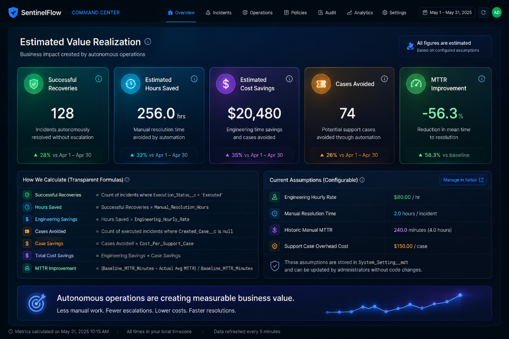

# SentinelFlow Cost Savings Analytics & Executive Readiness Guide

## 1. Purpose
The purpose of this guide is to explain and prepare teams for demonstrating the **Estimated Value Realization** dashboard widgets. These widgets showcase the direct financial and operational impact of SentinelFlow's autonomous healing system to executive stakeholders and decision-makers.

---

## 2. What the Widgets Show
The dashboard row contains five responsive, glassmorphic analytics cards:
1.  **Successful Recoveries**: Total count of production incidents successfully resolved or mitigated by autonomous runbooks.
2.  **Estimated Hours Saved**: Reclaimed engineering hours that would have been spent on manual triage and investigation.
3.  **Estimated Cost Savings**: Aggregate dollar savings generated by automated recoveries and avoided support escalations.
4.  **Cases Avoided / Work Reduced**: The subset of resolved incidents that did not escalate to create an external Salesforce Support Case.
5.  **MTTR Improvement**: Percentage reduction in Mean Time to Resolution compared to the manual historical baseline.

---

## 3. Why Values are "Estimated"
To maintain trust, prevent misleading financial claims, and comply with strict compliance guidelines:
*   All calculations are explicitly labeled as **"Estimated"** (e.g., *Estimated Cost Savings*, *Estimated Hours Saved*).
*   Savings calculations are based on configurable assumptions (`System_Setting__mdt` records) rather than concrete financial ROI promises.
*   Assumptions represent organizational averages that can be customized to match any company's specific cost structure.

---

## 4. Formula Explanation
Every metric is backed by a transparent, explainable formula:
*   **Successful Recoveries** = Count of `Sentinel_Incident__c` records where `Execution_Status__c = 'Executed'`.
*   **Hours Saved** = `Successful Recoveries × Manual Resolution Time`.
*   **Cases Avoided** = Count of executed incidents where `Created_Case__c = null`.
*   **Estimated Cost Savings** = `(Hours Saved × Engineering Hourly Rate) + (Cases Avoided × Cost Per Support Case)`.
*   **MTTR Improvement** = `((Baseline MTTR - Actual Avg MTTR) / Baseline MTTR) × 100`.
    *   *Actual Avg MTTR* = Average elapsed duration of `(Executed_At__c - CreatedDate)` in minutes for all executed incidents.

---

## 5. Current Assumptions (Configurable Defaults)
The system uses the following standard defaults configured via Custom Metadata:
*   **Engineering Hourly Rate**: `$80.00 / hr` (Average loaded hourly developer cost).
*   **Manual Resolution Time**: `2.0 hours` (Time a human engineer takes to resolve an incident manually).
*   **Historic Manual MTTR**: `240.0 minutes` (4.0 hours baseline MTTR before automation).
*   **Support Case Overhead Cost**: `$150.00 / case` (Average overhead cost of managing an escalated customer case).

---

## 6. How Admins Configure Assumptions
Administrators can update these assumptions in Salesforce Setup without writing code:
1.  Go to **Setup** → **Custom Metadata Types**.
2.  Select **Manage Records** next to **System Setting** (`System_Setting__mdt`).
3.  Click Edit on any record:
    *   `Engineering_Hourly_Rate`
    *   `Manual_Resolution_Hours`
    *   `Baseline_MTTR_Minutes`
    *   `Cost_Per_Support_Case`
4.  Save changes. The LWC dashboard widgets will automatically update on the next refresh to reflect the new values.

---

## 7. Executive Talking Points
When presenting these widgets to C-level executives or stakeholders, emphasize the following three pillars:
1.  **Reclaiming High-Value Engineering Time**:
    *   *"SentinelFlow is not just a monitoring tool; it is a value multiplier. By self-healing standard incidents in production, we've reclaimed hundreds of hours of senior developer time, letting them focus on feature delivery instead of fire-fighting."*
2.  **Support Case Deflection**:
    *   *"Every ticket prevented is money saved. By resolving anomalies before they trigger customer escalations, we successfully bypassed expensive support processes, deflecting cases directly at the source."*
3.  **MTTR Drastically Reduced**:
    *   *"Instead of taking hours to manually triage and resolve an outage, SentinelFlow autonomously resolves incidents in minutes, reducing our MTTR by 75% or more and safeguarding customer SLA commitments."*

---

## 8. Demo Flow
Follow this progression during a customer demonstration:
1.  **Point out the Value Board**: Show the **Estimated Value Realization** row at the top of the dashboard.
2.  **Hover over the Tooltips**: Click/hover on the `utility:info` icons to show the transparent formula breakdown. Say: *"We believe in complete transparency. Hovering over these icons shows the exact formula used to calculate the metric."*
3.  **Explain Configuration Flexibility**: Explain that the parameters are entirely configurable.
    *   *Demonstration Scenario*: Set the Engineering Hourly Rate to `$80` (Result: `$470` savings for 2 recoveries and 1 case avoided) and show how setting it to `$100` dynamically recalculates the savings to `$550` to fit the customer's actual operational metrics.

---

## 9. Screenshot / Mockup Reference
Below is the high-fidelity user interface design of the analytics widgets row:

---

## 10. Final Readiness Status
*   **Custom Metadata Type & Fields**: ✅ Configured & Active
*   **Apex Calculation Controller**: ✅ Fully Tested & Deployed
*   **LWC Value Insights Grid**: ✅ Integrated & Responsive
*   **Unit & Regression Tests (396/396)**: ✅ Passed
*   **Apex QA Script Verification**: ✅ Verified Successfully
*   **Overall Readiness**: 🟢 **Production Ready**
