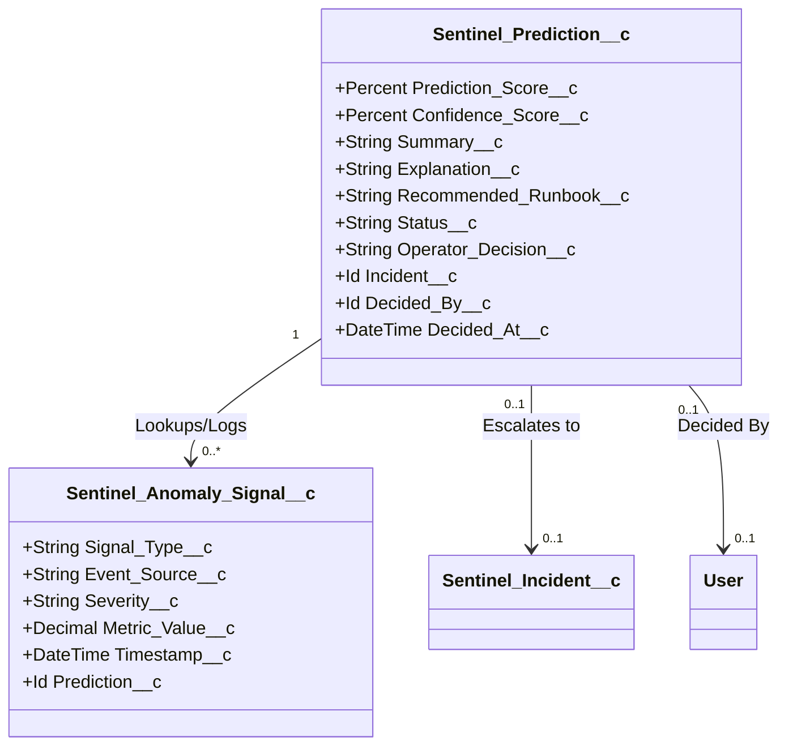

# SentinelFlow Prediction Engine Data Model Design (Milestone 54B)

**Date**: 2026-05-30  
**Author**: TomCodeX Engineering  
**Status**: Proposal  
**Version**: 1.0  

---

## 1. Purpose

The purpose of this document is to define the Salesforce custom metadata and schema design required to store anomaly signals, generated predictions, explainability logs, and operator feedback. This metadata architecture provides the foundation for audit tracking, reporting, and model feedback loops.

---

## 2. Data Model Overview

The prediction data model consists of two primary custom objects linked through lookup relationships:
1.  **`Sentinel_Anomaly_Signal__c`**: Stores high-frequency, telemetry-level telemetry events (such as log anomalies, retry count spikes, or metadata change timestamps) that serve as input features for predictions.
2.  **`Sentinel_Prediction__c`**: Models a single prediction card generated by the scoring engine, detailing anomaly probabilities, explainable analysis, suggested mitigations, and the operator's decision.

### Entity Relationship Diagram (ERD)



---

## 3. Sentinel_Anomaly_Signal__c Object Design

Stores raw/normalized telemetry data points identified as anomalous by SentinelFlow ingestion pipelines.

*   **API Name**: `Sentinel_Anomaly_Signal__c`
*   **Label**: `Sentinel Anomaly Signal`
*   **Plural Label**: `Sentinel Anomaly Signals`
*   **Deployment Status**: Deployed

---

## 4. Sentinel_Prediction__c Object Design

Models predictions generated by the scoring engine, tracking operator governance feedback.

*   **API Name**: `Sentinel_Prediction__c`
*   **Label**: `Sentinel Prediction`
*   **Plural Label**: `Sentinel Predictions`
*   **Deployment Status**: Deployed

---

## 5. Field List & Types

### A. Sentinel_Anomaly_Signal__c Fields

| Field Label | API Name | Type | Length/Scale | Description / Constraints |
|---|---|---|---|---|
| **Signal Type** | `Signal_Type__c` | Picklist | - | Categories: `Flow Failure`, `Integration Error`, `Apex Exception`, `Retry Spike`, `Deployment Activity`. |
| **Event Source** | `Event_Source__c` | Text | 255 | Key identifier: e.g. Class name, endpoint URL, flow developer name, metadata component developer name. |
| **Severity** | `Severity__c` | Picklist | - | Values: `Low`, `Medium`, `High`, `Critical`. |
| **Metric Value** | `Metric_Value__c` | Decimal | 18, 2 | Measured change, e.g., error rate percentage spike, count of timeouts, or duration delta. |
| **Timestamp** | `Timestamp__c` | DateTime | - | Date and time when the anomaly signal was registered. |
| **Prediction** | `Prediction__c` | Lookup | (`Sentinel_Prediction__c`) | Lookup to link this contributing signal to a compiled prediction card. |

### B. Sentinel_Prediction__c Fields

| Field Label | API Name | Type | Length/Scale | Description / Constraints |
|---|---|---|---|---|
| **Prediction Score** | `Prediction_Score__c` | Percent | 3, 0 | Calculated probability score of impending outage/failure (0% to 100%). |
| **Confidence Score** | `Confidence_Score__c` | Percent | 3, 0 | Model confidence score based on signal reliability and data volume (0% to 100%). |
| **Summary** | `Summary__c` | Text | 255 | Short executive overview of the predicted event. |
| **Explanation** | `Explanation__c` | Long TextArea | 32,768 | Detailed correlation breakdown explaining exactly *why* the prediction was generated. |
| **Recommended Runbook** | `Recommended_Runbook__c` | Text | 255 | Developer Key of the runbook recommended for proactive mitigation. |
| **Status** | `Status__c` | Picklist | - | Values: `Open`, `Under Review`, `Escalated`, `Dismissed`. |
| **Operator Decision** | `Operator_Decision__c` | Picklist | - | Feedback categories: `Approved Mitigation`, `Dismissed - False Positive`, `Dismissed - Ignore`. |
| **Incident** | `Incident__c` | Lookup | (`Sentinel_Incident__c`) | Populated if the prediction escalates or is promoted to a standard Sentinel Flow Incident. |
| **Decided By** | `Decided_By__c` | Lookup | (`User`) | User ID of the operator who reviewed and acted on the prediction. |
| **Decided At** | `Decided_At__c` | DateTime | - | Date and time when the operator submitted their decision. |

---

## 6. Relationships & Cardinality

1.  **Prediction to Anomaly Signals (One-to-Many)**: A single `Sentinel_Prediction__c` record can aggregate multiple `Sentinel_Anomaly_Signal__c` records to explain its score (e.g., correlation of 1 deployment signal and 3 integration logs).
2.  **Prediction to Incident (One-to-One / Lookup)**: Optional lookup linking a prediction to the resulting `Sentinel_Incident__c` if the proactive mitigation fails and a real incident eventually occurs.

---

## 7. Status Lifecycle

```
       [ Prediction Generated ]
                  │
                  ▼
              ┌───────┐
              │ Open  │
              └───┬───┘
                  │ Operator Inspects
                  ▼
         ┌──────────────────┐
         │   Under Review   │
         └────────┬─────────┘
                  ├─────────────────────────┐
                  │ Operator Approves       │ Operator Dismisses
                  ▼                         ▼
           ┌────────────┐            ┌─────────────┐
           │ Escalated  │            │  Dismissed  │
           └────────────┘            └─────────────┘
```

---

## 8. Security & FLS Model

*   **Sharing Model**: Public Read/Write for SentinelFlow administrators and operators.
*   **Permission Sets**:
    *   **SentinelFlow_Admin**: Full CRUD permissions + FLS Read/Write on all prediction metadata fields.
    *   **SentinelFlow_Operator**: Read/Edit access to update Status, Operator Decision, Decided By, and Decided At. No delete permissions allowed.
*   **FLS Safety Rules**:
    *   `Explanation__c` and `Event_Source__c` fields must never store encrypted connection details, passwords, or PII payloads.

---

## 9. Data Retention Policy

Telemetry databases grow rapidly. To prevent Salesforce data storage exhaustion:
1.  **Anomaly Signals**: Automatically pruned after **30 days** using a scheduled batch job.
2.  **Predictions**: Retained for **180 days** to support operational audit reports and model refinement analytics before archiving.

---

## 10. Reporting Use Cases

*   **Prediction Accuracy Rate**:
    $$\text{Accuracy} = \frac{\text{Escalated Predictions}}{\text{Escalated Predictions} + \text{Dismissed (False Positives)}} \times 100$$
*   **Value Generation Tracking**: Correlating `Escalated` predictions with execution records to report hours and costs saved by preventing incidents.

---

## 11. Success Criteria

- [ ] Complete metadata mapping of fields and picklists.
- [ ] No recursive triggers or database performance blockages during high-volume anomaly writes.
- [ ] The schema supports the dashboard LWC without requiring heavy query joins.
