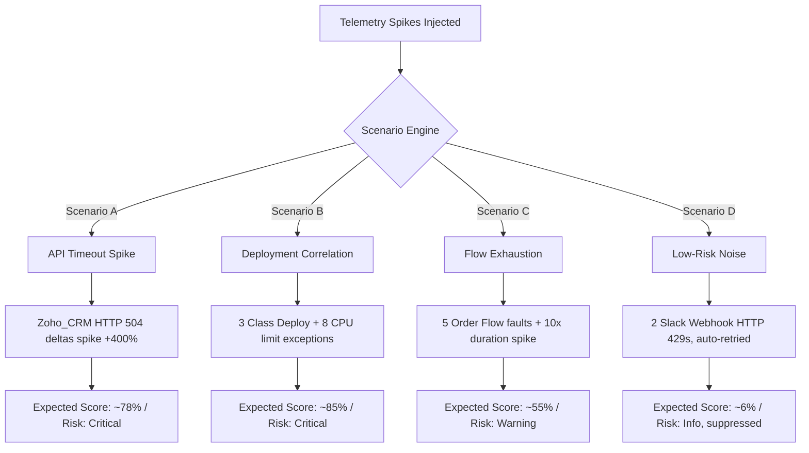

# SentinelFlow Prediction Engine Pilot Scope (Milestone 57A)

**Date**: 2026-05-30  
**Author**: TomCodeX Engineering  
**Status**: Approved  
**Version**: 1.0  
**Target Environment**: `vjdev@asap.com`  

---

> [!IMPORTANT]
> **GOVERNANCE MANDATE: STRICTLY ADVISORY PILOT**
> During the entire duration of the Pilot Run, the Prediction Engine is **strictly advisory**. There is **no autonomous execution of preemptive runbooks or automated system changes**. 
> The system is configured to warn and recommend. The human operator retains absolute execution authority. Every recommended runbook must be manually approved, validated, and initiated by a licensed operator. The pilot's sole goal is to establish operational trust, calibration baseline, and algorithm accuracy before Auto-Heal GA promotion.

---

## 1. Purpose

The transition of SentinelFlow from reactive incident resolution to proactive anomaly forecasting requires strict validation under realistic operational environments. While QA simulations verify transactional and logic integrity, the true efficacy of the predictive layer is measured against real human operators.

The purpose of the **Prediction Engine Pilot Run** is to:
1.  **Validate Predictive Utility**: Determine if advisory cards give operators early warning of imminent failures, improving their reaction time.
2.  **Calibrate Scoring Algorithms**: Use daily operational telemetry to fine-tune linear weights, decay parameters, and threshold constants.
3.  **Establish Human Trust**: Prove to operator teams that the engine does not generate alarm fatigue or present "black box" recommendations.
4.  **Confirm Governance Compliance**: Ensure the system preserves the human-in-the-loop safety boundary with zero bypasses or autonomous DML actions.

---

## 2. Pilot Scope

The pilot is strictly scoped to a controlled set of active integration connectors, system telemetry signals, and transactional operations to minimize operational risk while gathering high-value calibration data.

### In-Scope vs. Out-of-Scope Parameters:

```
+-----------------------------------------------------------------------------------+
|                                  PILOT RUN SCOPE                                  |
+-----------------------------------------------------------------------------------+
|  IN-SCOPE (Monitored Elements)               |  OUT-OF-SCOPE (Excluded Elements)  |
|----------------------------------------------|------------------------------------|
|  * Connectors: Zoho_CRM, HubSpot_Sync        |  * Production Org Environments     |
|  * Processes: Order_Processing_Flow          |  * Autonomous Remediation Trigger  |
|  * Signals: CPU timeout exceptions, Flow     |  * Direct Downstream DML changes   |
|    fault events, HTTP 504 timeouts, HTTP     |    without operator verification   |
|    429 rate limit exceptions, metadata       |  * Legacy API integrations lacking |
|    deployment audit events.                  |    Active Telemetry instrumentation|
+-----------------------------------------------------------------------------------+
```

### In-Scope Alert Configurations:
- **Critical Anomaly Cards**: Triggered when calculated `Anomaly_Score__c` $\ge 70\%$. Displays crimson-pulsed borders on the dashboard.
- **Warning Anomaly Cards**: Triggered when `Anomaly_Score__c` is between $40\%$ and $69\%$. Displays warm amber glow borders.
- **Silent Logging (Info)**: Triggered when `Anomaly_Score__c` $< 40\%$. Silently written to `Sentinel_Anomaly_Signal__c` database for trend analysis; no LWC cards rendered.

---

## 3. Pilot Duration

The Pilot Run will execute for a continuous duration of **30 calendar days** in the target sandbox environment, structured into three distinct phases to ensure orderly calibration.

```
       [ Phase 1: Ingestion & Baseline Calibration ]
       - Days 1 to 7
       - Focus: Background signal monitoring, scoring convergence, and threshold adjustment.
                           |
                           v
       [ Phase 2: Live Operator Advisory Monitoring ]
       - Days 8 to 21
       - Focus: Full LWC interactive dashboard access, manual feedback capture, and weight penalty testing.
                           |
                           v
       [ Phase 3: Performance Validation & Gates Audit ]
       - Days 22 to 30
       - Focus: Rolling Operational Trust Score (OTS) tracking, error auditing, and Go/No-Go validation.
```

### Operational Timeline & Checkpoints:
*   **Daily Evaluation Checkpoint**: Every business day at **4:00 PM**, the SRE lead reviews the rolling Precision, Recall, and OTS indices.
*   **Weekly Weight Calibration**: Every Friday morning, administrators review the automated `PREDICTIVE_TUNING_SUGGESTION` logs in `Sentinel_Error_Log__c` and apply necessary customizations to `System_Setting__mdt` records.

---

## 4. Test Org / Environment

The Pilot Run is deployed and executed entirely within the isolated Salesforce Developer Sandbox to ensure safety and sandbox isolation.

### Environment Specifications:
*   **Target Org Username**: `vjdev@asap.com`
*   **Telemetry Generation Service**: Background apex scheduling classes mock realistic downstream traffic ( Zoho CRM payloads, HubSpot sync tasks, and high-frequency sales orders).
*   **System Configuration**:
    - Scoring Evaluation Window (`Prediction_Scoring_Window_Minutes`): **5 minutes**.
    - Confidence Decay Half-Life (`Prediction_Decay_HalfLife_Minutes`): **15 minutes**.
*   **Security Restrictions**: Custom Apex metadata modifications are restricted to designated system administrators. Transaction boundaries are strictly enforced to prevent lock conflicts or governor limit breaches.

---

## 5. Signal Scenarios Included

To ensure thorough evaluation, the pilot includes four controlled signal scenarios representing the most common failure modes observed in enterprise monitoring environments.



### Signal Specifications:
1.  **Scenario A — API Timeout Spike (Zoho_CRM)**: Simulates downstream system timeouts with consecutive HTTP 504 errors. Verifies high-risk warning generation.
2.  **Scenario B — Deployment Correlation (Apex trigger CPU exception)**: Simulates a bad deployment throwing CPU limit warnings within 2 minutes of metadata changes. Verifies deployment correlation rules.
3.  **Scenario C — Flow Exhaustion (Order Processing Flow)**: Simulates interview queues locking up with 10× average execution duration spikes. Verifies mid-level warning states.
4.  **Scenario D — Low-Risk Noise (Slack Integration)**: Simulates minor rate throttling. Verifies noise suppression rules by showing zero cards for temporary, self-healing events.

---

## 6. Operator Participants

The pilot leverages a dedicated team of human-in-the-loop operators representing diverse operational roles and permission sets to evaluate usability, governance, and trust.

### Onboarding & Role Matrix:

| Participant Name | Role | Primary Responsibility | Assigned Permission Set |
|---|---|---|---|
| **Alex Rivera** | Tier-2 SRE Lead | Evaluates warning utility, reviews qualitative explanations, and authorizes preemptive runbooks. | `SentinelFlow_Operator` |
| **Priya Patel** | Senior SRE Engineer | Monitors real-time LWC dashboard, reviews HubSpot/Zoho cards, and logs dismissal reasons. | `SentinelFlow_Operator` |
| **Mark Johnson** | Site Reliability Engineer | Reviews incident linking, verifies manual rollback checklists, and evaluates card aesthetics. | `SentinelFlow_Operator` |
| **Sarah Jenkins** | Salesforce System Admin | Monitors governor limit metrics, reviews `Sentinel_Error_Log__c` suggestions, and updates weights. | `SentinelFlow_Admin` |
| **Tom Chen** | Director of Operations | Audit log reviewer, assesses trust metrics daily, and leads the final Go/No-Go evaluation. | `SentinelFlow_Admin` |

### Operator Onboarding Tasks:
- [ ] Complete a 30-minute interactive walkthrough of the LWC Prediction Center dashboard.
- [ ] Assign explicit permission sets to ensure FLS controls prevent unauthorized data transitions.
- [ ] Establish a dedicated Slack communication channel `#sentinelflow-pilot-feedback` for real-time qualitative coordination.

---

## 7. Prediction Monitoring Process

The prediction monitoring workflow ensures that every generated prediction card, operator decision, and background calculation is audited and visualized in near real-time.

```
                  +----------------------------------------------+
                  |  Background Telemetry Signal Ingestion Event |
                  +----------------------------------------------+
                                         |
                                         v
                  +----------------------------------------------+
                  |  SentinelPredictionEngine.evaluate() Runs    |
                  +----------------------------------------------+
                                         |
                                         v
                  +----------------------------------------------+
                  |      Sentinel_Prediction__c Created          |
                  +----------------------------------------------+
                                         |
                                         v
                  +----------------------------------------------+
                  | LWC Dashboard Subscribes to Dashboard Event  |
                  | SentinelFlow_Dashboard_Event__e Published    |
                  +----------------------------------------------+
                                         |
                                         v
                  +----------------------------------------------+
                  |     Human Operator Interacts with LWC Card   |
                  +----------------------------------------------+
                                         |
                  +----------------------+----------------------+
                  | (Approve Action)                            | (Dismiss Action)
                  v                                             v
+------------------------------------+        +------------------------------------+
| - Incident Created (Pending Appr)  |        | - Score Penaltied (P=0.85)         |
| - Sentinel_Audit_Log__c Inserted   |        | - Suppression Cooldown Counted     |
| - Dashboard Updated (AI_TRACE_UPD) |        | - Dismissal Reason Modal Dialog    |
+------------------------------------+        +------------------------------------+
```

### Programmatic Checkpoint Monitoring:
*   **LWC Real-Time Subscription**: The `zentomDashboard` LWC component utilizes `lightning/empApi` to subscribe to the custom platform event `/event/SentinelFlow_Dashboard_Event__e`.
*   **Audit Trail Ingestion**: Any mutation to a prediction's status triggers the creation of a parent `Sentinel_Audit_Log__c` record containing the operator ID, timestamp, decision, and comments.

---

## 8. Accuracy Metrics

The performance and calibration of the Prediction Engine during the pilot run are monitored mathematically using statistical indices calculated daily over rolling windows.

### Primary Operational KPIs:

-   **Precision (Noise prevention Gate)**: Measures how often predicted anomalies represent true system degradation:
    $$\text{Precision} = \frac{\text{True Positives}}{\text{True Positives} + \text{False Positives}} \ge 90\%$$
-   **Recall (Failure Catch Gate)**: Measures the system's sensitivity to imminent errors:
    $$\text{Recall} = \frac{\text{True Positives}}{\text{True Positives} + \text{False Negatives}} \ge 92\%$$
-   **Exponential Time-Decay OTS (Operational Trust Score)**: The ultimate metric gating GA promotion, balancing Precision ($40\%$ weight) and Recall ($60\%$ weight):
    $$\text{OTS}_{\text{rolling}} = \frac{\sum_{d=1}^{30} e^{-\lambda d} \cdot \left( 0.40 \times \text{Precision}_d + 0.60 \times \text{Recall}_d \right)}{\sum_{d=1}^{30} e^{-\lambda d}}$$
    Where $\lambda = 0.1$ dampens older history, highlighting recent tuning improvements.

---

## 9. Feedback Capture Process

Every human interaction with a prediction card is audited to support system accountability, qualitative analysis, and dynamic model calibration.

### Text-Based Operator Feedback Modal Layout:
```
+-------------------------------------------------------------+
|               Dismiss Advisory Alert?                       |
+-------------------------------------------------------------+
|  Provide a brief reason to help SentinelFlow tune itself:   |
|                                                             |
|  [ Planned Maintenance / Batch Jobs                    ] V  |
|                                                             |
|  Comments (Optional):                                       |
|  [ Ingesting 200k leads from legacy system. Expected.     ] |
|                                                             |
|                   [ Cancel ]   [ Confirm Dismiss ]          |
+-------------------------------------------------------------+
```

### Qualitative Data Fields Collected:
*   **Dismissal Reason Picklist**: Tracks standard classifications (`Planned Maintenance / Batch`, `Transient Network Glitch`, `Incorrect Threshold Tuning`, `Duplicate Alert`, `Other`).
*   **Feedback Comments TextArea**: Captured in `Feedback_Comments__c` to store qualitative SRE context.
*   **Operator User Link**: Captures `Operator_User__c` lookup targeting the active Salesforce User ID.
*   **Millisecond Timestamp**: Captures `Decision_Timestamp__c` to audit human response latency.

---

## 10. Go / No-Go Criteria for Auto-Heal GA

Transitioning the Prediction Engine from Advisory Pilot Mode to Autonomous Predictive Remediation (Auto-Heal GA) requires passing all 7 strict Trust Gates. A single failure restarts the 30-day evaluation window.

### Trust Gates Dashboard Grid:

| Gate # | Trust Gate Metric | Baseline Target | Minimum Success Threshold | Go/No-Go Impact |
|---|---|---|---|---|
| **1** | **Pilot Duration** | 30 Days | 30 full consecutive days | **Critical Gate**: Outages reset window. |
| **2** | **Signal Volume** | $\ge 100$ Triggers | Ingestion of 100+ telemetry spikes | **Audit Gate**: Ensures dataset size is valid. |
| **3** | **Precision Rate** | $\ge 90\%$ | $\ge 90.0\%$ Precision | **Noise Gate**: Rejection resets GA path. |
| **4** | **Recall Rate** | $\ge 92\%$ | $\ge 92.0\%$ Recall | **Safety Gate**: Missed outages block GA. |
| **5** | **OTS Level** | $\ge 90\%$ | $\ge 90.0\%$ Operational Trust | **Executive Gate**: Master gating KPI. |
| **6** | **Governor Limits** | 0 warnings | 0 Apex timeout or heap limit errors | **Technical Gate**: Errors require code fix. |
| **7** | **Governance Compliance** | 0 breaches | 0 autonomous DML executions | **Security Gate**: Bypasses block promotion. |

-   **Go Decision**: Confirmed when all 7 trust gates are checked as Green ($\ge$ minimum threshold) at the end of the 30-day pilot run.
-   **No-Go Decision**: Active if any gate drops to Red. The team must apply code fixes, re-calibrate the scoring service, and initiate a new 30-day validation pilot.

---

*End of Prediction Engine Pilot Scope.*
