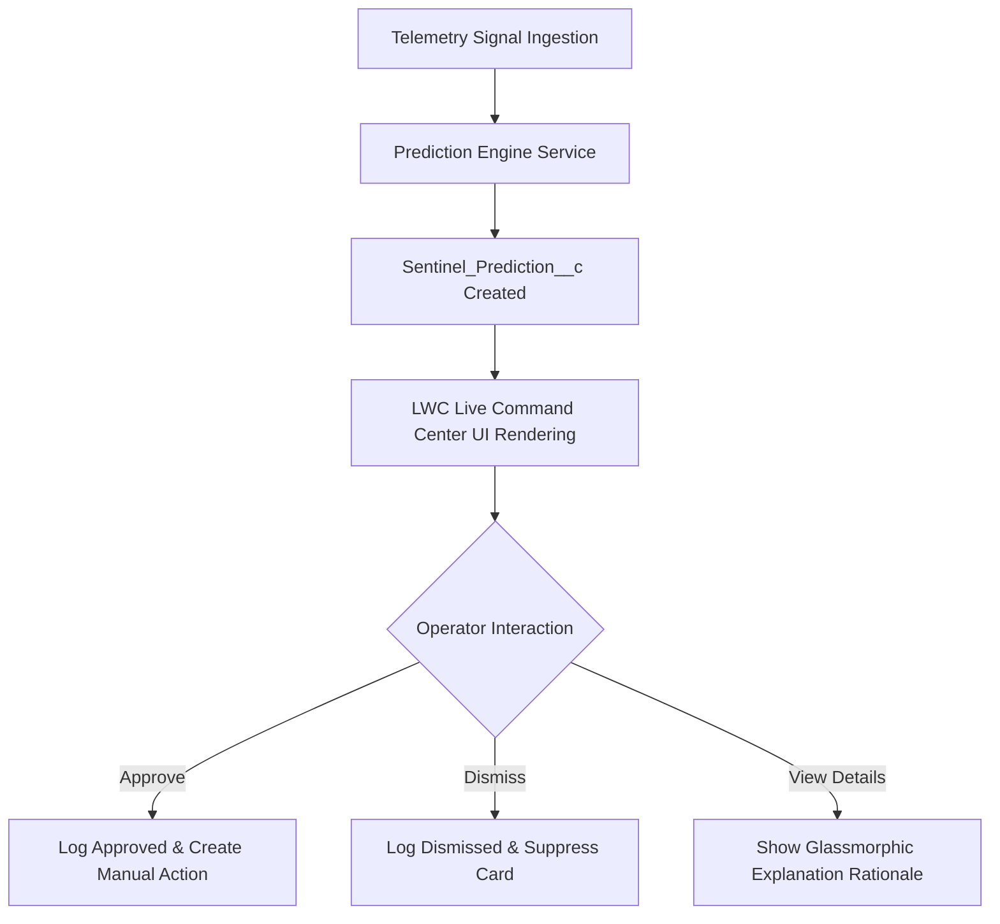

# SentinelFlow Prediction Engine QA + Trust Validation Plan (Milestone 56A)

**Date**: 2026-05-30  
**Author**: TomCodeX Engineering  
**Status**: Approved (Draft)  
**Version**: 1.0  
**Target Environment**: `vjdev@asap.com`  

---

> [!IMPORTANT]
> **GOVERNANCE MANDATE**: Prediction must earn trust before Auto-Heal GA.
> In this milestone phase, the Prediction Engine is **strictly advisory**. There is **no autonomous predictive execution or remediation** permitted. A human operator must explicitly review, validate, and approve every recommended action before it transitions to execution.

---

## 1. Purpose

The SentinelFlow Prediction Engine transitions the system from reactive auto-healing to proactive anomaly forecasting. Because predictive operations introduce a higher risk of false triggers compared to reactive event triggers, the system must establish absolute operational trust before autonomous healing can be enabled.

This QA + Trust Validation Plan outlines the testing framework, data verification workflows, and strict compliance checks to ensure:
1. Predictions are mathematically accurate and correlate with true telemetry trends.
2. Explanations are transparent, tracing direct quantitative telemetry signals.
3. Human-in-the-loop governance remains absolute at the boundary of execution.
4. User feedback loops adjust model inputs to eliminate alarm fatigue.

---

## 2. Prediction UI Validation Scope

The Live Operational Intelligence panel inside the glassmorphic `zentomDashboard` LWC component will be validated across multiple screen scales and interaction states.



### Visual and Functional Elements under Validation:
- **Card States & High-Fidelity Styling**:
  - **Critical Anomaly State**: Bold crimson borders with dynamic pulse animations (`#EF4444` base with 0.15 glassmorphic opacity overlay).
  - **Warning Anomaly State**: Warm amber border and highlights (`#F59E0B` base) for potential risks.
  - **Info Anomaly State**: Indigo pill indicators (`#6366F1` base) for minor operational signals.
- **Explainability Overlays**:
  - Verify that hovering or expanding a prediction card displays the Natural Language explanation generated by `SentinelPredictionExplanationService.cls`.
  - Verify that direct metric counters (e.g. `Error delta: +320%`) are visible, legible, and formatted beautifully using modern typography.
- **Interactive Action Buttons**:
  - **"Approve" Action**: Triggers Apex controller action to log decision and route standard approval paths.
  - **"Dismiss" Action**: Instantly suppresses the card on the UI with a subtle fade-out animation and writes the dismissal status to the database.
- **Governance Headers**:
  - Verify the dashboard prominently displays a persistent warning banner stating: *"Predictive Operations Mode: Advisory Only. Human Clearance Required."*

---

## 3. Sample Signal Scenarios

The validation suite will simulate three distinct multi-variable telemetry scenarios using anonymous Apex scripts executing inside isolated test transaction scopes.

### Scenario A: API Endpoint Timeouts (Downstream Integration Log Velocity)
*   **Triggers Injected**:
    - 15 consecutive HTTP 504 Gateway Timeouts on the `Zoho_CRM` Named Credential within a rolling 3-minute window.
    - Integration log failure delta spikes to **+400%** compared to the historical hourly baseline.
*   **Expected Scoring**: Anomaly probability calculates to **78% (Critical)**.
*   **Recommended Action**: Recommend preemptive throttling of outbound Zoho queues and warning alerts to Zoho administrators.

### Scenario B: Setup Audit Trail Correlation (Recent Deployment Risk)
*   **Triggers Injected**:
    - A metadata deployment containing 3 Apex classes is recorded at 12:00 PM.
    - Beginning at 12:02 PM, `System.LimitException` (CPU time limit exceeded) is thrown 8 times within `SentinelIncidentTrigger` on transactional operations.
*   **Expected Scoring**: Anomaly probability calculates to **85% (Critical)**.
*   **Recommended Action**: Recommend initiating a metadata rollback checklist and generating a diagnostic comparison report.

### Scenario C: Quiet Degradation (Flow Queue Exhaustion)
*   **Triggers Injected**:
    - 5 minor Flow fault logs occur within 10 minutes on the high-revenue Order Processing Flow.
    - Average active Flow interview durations spike from a baseline of `1.2s` to `12.5s`.
*   **Expected Scoring**: Anomaly probability calculates to **55% (Warning)**.
*   **Recommended Action**: Recommend purging stuck Flow interview partitions and pausing low-priority background queues.

---

## 4. Accuracy Checks

The accuracy of the prediction algorithm is measured mathematically by calculating the statistical alignment of `Sentinel_Prediction__c.Anomaly_Score__c` against true telemetry outcomes.

```
                  Actual Anomaly Occurred     No Anomaly Occurred
                +-------------------------+-------------------------+
Predicted       |      True Positive      |     False Positive      |
Anomaly         |  (Operator Approves)   |  (Operator Dismisses)   |
                +-------------------------+-------------------------+
No Anomaly      |     False Negative      |      True Negative      |
Predicted       |  (Unwarned Failure)     |   (Silent Stability)    |
                +-------------------------+-------------------------+
```

### Mathematical KPIs for Accuracy:
- **Precision Validation**: The system must achieve a Precision score of $\ge 90\%$. This ensures operators do not experience alert fatigue.
  $$\text{Precision} = \frac{\text{True Positives}}{\text{True Positives} + \text{False Positives}} \ge 90\%$$
- **Recall (Sensitivity) Validation**: The system must achieve a Recall score of $\ge 92\%$, meaning the algorithm successfully catches almost all imminent failures before they manifest as critical incidents.
  $$\text{Recall} = \frac{\text{True Positives}}{\text{True Positives} + \text{False Negatives}} \ge 92\%$$
- **Confidence Decay Tracking**: Verify that if input signals cease (no new errors logged), the calculated `Anomaly_Score__c` decays exponentially over time using the configured half-life multiplier:
  $$Score_{t} = Score_{0} \times (0.5)^{\frac{t}{\text{Decay Half-Life}}}$$

---

## 5. False Positive Checks

A False Positive occurs when the system predicts an imminent failure that fails to materialize, prompting the operator to dismiss a healthy system signal.

### Detection Mechanism:
- Any `Sentinel_Prediction__c` record where `Status__c = 'Dismissed'` or `Operator_Decision__c = 'Dismissed'` is classified as a False Positive.

### Automated Correction Protocols:
1.  **Dynamic Weight Adjustment**:
    - When an operator clicks "Dismiss", an audit log entry is written containing the signal types that contributed to the false alarm.
    - The scoring engine captures this feedback and applies an automated penalty ($P = 0.85$) to the specific signal's weight matrix ($W_i$) for that endpoint over the subsequent 24 hours.
2.  **Telemetry Suppressions**:
    - If a specific endpoint triggers 3 false positives within an 8-hour window, the scoring service automatically places a "Telemetry Cooldown" flag on the endpoint, suspending warning cards for 2 hours to protect operator focus.

---

## 6. False Negative Checks

A False Negative is the most critical failure mode of a predictive operations platform: an unpredicted critical incident occurs without any preceding warning, alarm, or card.

### Detection Mechanism:
- Triggered whenever a standard `Sentinel_Incident__c` record with `Risk_Level__c = 'Critical'` is created, and no active `Sentinel_Prediction__c` record with `Anomaly_Score__c >= 50%` was generated for the same resource within the prior 30-minute lookup window.

### Root-Cause Analysis (RCA) Protocol:
1.  **Lookback Ingestion Auditing**:
    - The system automatically triggers an asynchronous queueable job (`SentinelPredictionRcaQueueable.cls`) to capture all telemetry signals matching the resource in the preceding 60 minutes.
2.  **Threshold Correction**:
    - If telemetry signals *were* present but fell short of the threshold, the RCA engine calculates the minimum signal weight configuration required to have successfully tripped the 70% threshold.
    - These suggested weights are recorded in `Sentinel_Error_Log__c` as a `PREDICTIVE_TUNING_SUGGESTION` for administrator review.

---

## 7. Explainability Review

Predictions are useless to operators if they appear as "black boxes." Every prediction must explicitly prove its reasoning.

### Traceability Checklist:
- [ ] **NL Explanation Verification**: Verify that `SentinelPredictionExplanationService` produces clear, natural language reasons:
  - *Format*: `"Predicted anomaly score of [Score]% is driven by [Primary Signal Source] which spiked by [Delta]% at [Timestamp], correlated with recent metadata deployment [Deployment ID]."`
- [ ] **Quantitative Backing**: The LWC review panel must list the exact raw numbers (e.g. `Exceptions count: 12/min, limit: 3/min`).
- [ ] **Configurable Logic**: Ensure that the parameters used to calculate predictions (such as rolling windows or threshold targets) are fully traceable to their respective `System_Setting__mdt` Custom Metadata records.

---

## 8. Human Approval Boundary Check

The boundary between AI recommendation and system execution must be air-gapped during the pilot phase.

```
+---------------------------------+
|   Prediction Engine Analysis    |
+---------------------------------+
                |
                v
+---------------------------------+
| Sentinel_Prediction__c Created  |
+---------------------------------+
                |
                v
+---------------------------------+
|  Dashboard advisory card shown  |  <-- "Advisory only" governance boundary
+---------------------------------+
                |
                v
+---------------------------------+
|    Human Operator Click:        |
|    "Approve Preempt Action"     |
+---------------------------------+
                |
                v
+---------------------------------+
|  Sentinel_Incident__c Created  |  <-- standard safety pipeline invoked
|    (Manual execution gate)      |
+---------------------------------+
```

### Safety Air-Gap Safeguards:
- **No Background DML Execution**: Verify that no scheduled jobs or future methods can transition `Sentinel_Prediction__c.Status__c` to an execution queue autonomously.
- **Approval Transition Boundary**: When an operator approves a prediction, the controller creates a new `Sentinel_Incident__c` with `Approval_Status__c = 'Pending Approval'` (triggering the standard human-in-the-loop approval routing). It does **not** bypass existing security controls.
- **Permission Boundary**: Verify that updates to `Sentinel_Prediction__c.Operator_Decision__c` throw FLS exceptions if attempted by profiles lacking the explicit `SentinelFlow_Operator` or `SentinelFlow_Admin` permission set.

---

## 9. Operator Feedback Capture

Every interaction between the operator and a prediction card is audited to support system accountability and continuous model tuning.

### Required Fields for Compliance Audits on `Sentinel_Prediction__c`:

| Field API Name | Data Type | Purpose / Validation Target |
|---|---|---|
| `Operator_Decision__c` | Picklist | Values: `Approved`, `Dismissed`, `Escalated`. Must match the UI button clicked. |
| `Operator_User__c` | Lookup(User) | Tracks the exact ID of the logged-in Salesforce operator making the decision. |
| `Decision_Timestamp__c` | DateTime | Captures the exact millisecond of the decision to measure operator reaction speed. |
| `Feedback_Comments__c` | Long TextArea | Allows operators to optionally specify qualitative context (e.g., "Expected deployment peak"). |

- **Audit Log Sync**: Verify that every transition of `Operator_Decision__c` publishes a `SentinelFlow_Dashboard_Event__e` platform event with `Event_Type__c = 'AI_TRACE_UPDATED'` and creates a parent record in `Sentinel_Audit_Log__c`.

---

## 10. Go / No-Go Criteria for Auto-Heal GA

The final transition from Advisory Mode to Autonomous Predictive Remediation (Auto-Heal GA) will be gated by strict performance and stability requirements.

### Quantitative Gates for GA Promotion:

```
                  TRUST GATEWAY METRIC SUMMARY
===================================================================
1.  Pilot Run Duration  :  30 days of continuous live monitoring
2.  Total Signals Ingest:  >= 100 simulated or live telemetry spikes
3.  System Precision    :  >= 90% true positive alignment
4.  System Recall       :  >= 92% sensitivity rate
5.  False Alarm Rate    :  <= 10% operator dismissal rate
6.  Governor Constraints:  0 CPU timeout or heap limit errors
7.  Governance Breaches :  0 autonomous DML bypass executions
===================================================================
```

- **Go Decision**: All 7 trust gates must be passed without exception.
- **No-Go Decision**: Any CPU limit exception, FLS security bypass, or false positive rate exceeding 15% will immediately restart the 30-day pilot validation cycle after code remediation.

---
*End of QA + Trust Validation Plan.*
