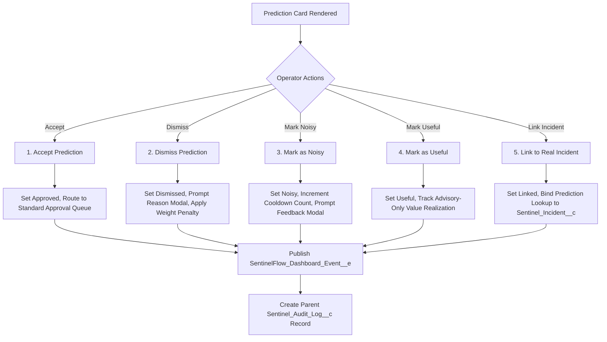

# SentinelFlow Prediction False Positive / False Negative Tracking Plan (Milestone 56C)

**Date**: 2026-05-30  
**Author**: TomCodeX Engineering  
**Status**: Approved  
**Version**: 1.0  
**Target Environment**: `vjdev@asap.com`  

---

> [!IMPORTANT]
> **GOVERNANCE MANDATE: ADVISORY PILOT MODE ONLY**
> In this milestone phase, the Prediction Engine is **strictly advisory**. There is **no autonomous predictive execution or auto-healing remediation** permitted. A human operator must explicitly review, validate, and approve every recommended action before it transitions to execution.
> The False Positive (FP) and False Negative (FN) tracking framework outlined here serves as a statistical trust gateway to validate system performance, calibrate algorithms, and earn operator confidence before autonomous predictive remediation can be considered for General Availability (GA).

---

## 1. Purpose

For an operational monitoring platform to transition from reactive triggering to predictive forecasting, it must be highly accurate and self-correcting. Uncalibrated prediction models lead to one of two critical failures:
1.  **Alarm Fatigue (False Positives)**: Operators are flooded with advisory cards for anomalies that never materialize, causing them to ignore real warnings.
2.  **Silent Failures (False Negatives)**: The system fails to predict a catastrophic outage, defeating the purpose of a proactive operational intelligence layer.

This document defines how **SentinelFlow** systematically records prediction mistakes, captures explicit human-in-the-loop operator feedback, performs automated root-cause analysis (RCA) on missed incidents, and computes a rolling **Operational Trust Score (OTS)**. This feedback loop ensures that the scoring engine dynamically calibrates itself and achieves the high performance gates required for GA promotion.

```
       +----------------------------------------------------+
       |          Telemetry Signal Ingestion                |
       +----------------------------------------------------+
                                 |
                                 v
       +----------------------------------------------------+
       |          SentinelPredictionEngine.cls              |
       +----------------------------------------------------+
                                 |
                                 v
       +----------------------------------------------------+
       |            Sentinel_Prediction__c Card             |
       +----------------------------------------------------+
                                 |
            +--------------------+--------------------+
            | (Operator Action)                       | (Operational Reality)
            v                                         v
+-----------------------+                 +-----------------------+
|  Dashboard Feedback:  |                 | Incident Occurred?    |
|  - Accept / Dismiss   |                 | - Yes: True Positive  |
|  - Mark Noisy/Useful  |                 | - No: False Positive  |
+-----------------------+                 +-----------------------+
            |                                         |
            +--------------------+--------------------+
                                 |
                                 v
       +----------------------------------------------------+
       |       Dynamic Scoring & Weight Calibrations        |
       |       Rolling Operational Trust Score (OTS)        |
       +----------------------------------------------------+
```

---

## 2. False Positive (FP) Definition

A **False Positive (FP)** occurs when the Prediction Engine warns about an imminent anomaly risk, but no real incident occurs within the specified operational window.

### Operational Classification:
A `Sentinel_Prediction__c` record is formally classified as a False Positive if:
1.  The record's calculated `Anomaly_Score__c` $\ge$ Warning Threshold ($40\%$).
2.  A predictive advisory card is rendered on the `zentomDashboard` LWC.
3.  **Either**:
    - The operator explicitly rejects the card by selecting **Dismiss** or **Mark as Noisy** on the UI.
    - The scoring tracking window (default: $60$ minutes) expires without any related `Sentinel_Incident__c` being created or linked.

### Mathematical Representation:
$$\text{False Positive} = \left( \text{Score} \ge 40\% \right) \land \left( \text{Status} \in \{\text{'Dismissed'}, \text{'Noisy'}\} \lor \nexists \, \text{Incident}_{\text{linked}} \text{ within } 60\text{m} \right)$$

### Database Representation & Metadata Fields:
On the `Sentinel_Prediction__c` object, False Positives are tracked using standard audit and operational fields:

```json
{
  "attributes": { "type": "Sentinel_Prediction__c" },
  "Anomaly_Score__c": 72.0,
  "Risk_Level__c": "Critical",
  "Status__c": "Dismissed",
  "Operator_Decision__c": "Dismissed",
  "Dismissal_Reason__c": "Transient Network Glitch",
  "Feedback_Comments__c": "Downstream Zoho sandbox was momentarily slow, but recovered automatically. No incident triggered.",
  "Decision_Timestamp__c": "2026-05-30T12:05:00.000Z",
  "Operator_User__c": "0058W000006HqYhQAK"
}
```

---

## 3. False Negative (FN) Definition

A **False Negative (FN)** is the most critical failure mode: no predictive warning card is shown, but a real operational incident occurs shortly after.

### Operational Classification:
A False Negative is registered whenever:
1.  A standard `Sentinel_Incident__c` is created with a `Severity__c` of **Critical** or **Warning**.
2.  **No** active `Sentinel_Prediction__c` record with an `Anomaly_Score__c` $\ge$ Warning Threshold ($40\%$) was generated for the same resource or endpoint within the preceding lookback window (default: $30$ minutes).

### Mathematical Representation:
$$\text{False Negative} = \left( \text{Incident Created} \right) \land \left( \nexists \, \text{Prediction} \text{ where } \text{Score} \ge 40\% \text{ and } t_{\text{prediction}} \in [t_{\text{incident}} - 30\text{m}, t_{\text{incident}}] \right)$$

### Lookback Audit Architecture:
When a False Negative is detected, the system triggers the asynchronous `SentinelPredictionRcaQueueable.cls` queueable class to reconstruct the signal timeline. It logs a programmatic entry to `Sentinel_Error_Log__c` classified as a `PREDICTIVE_TUNING_SUGGESTION` for manual administrator review.

```apex
// Programmatic Logging of False Negative RCA Suggestion
Sentinel_Error_Log__c fnLog = new Sentinel_Error_Log__c(
    Log_Type__c = 'PREDICTIVE_TUNING_SUGGESTION',
    Class_Name__c = 'SentinelPredictionRcaQueueable',
    Method_Name__c = 'analyzeFalseNegative',
    Error_Message__c = 'False Negative Detected: Incident INC-0947 occurred on Zoho_CRM at 12:15 PM without preceding prediction.',
    Stack_Trace__c = 'Signals present: Integration:504 (count: 4, delta: 120%). Score reached: 32%. Recommended Tuning: Increase Zoho_CRM integration signal weight W1 from 0.20 to 0.35.'
);
```

---

## 4. Operator Feedback Capture

The glassmorphic prediction card within the `zentomDashboard` LWC captures five distinct human-in-the-loop operator actions. Every action updates the database, publishes a platform event, and synchronizes the central audit trail.



### The 5 Operator Actions & System Behavior:

| # | Operator Action | UI Event Trigger | database Field Transitions | Event / Audit Outcome |
|---|---|---|---|---|
| **1** | **Accept Prediction** | Click `"Approve Preempt Action"` | `Status__c` $\to$ `'Approved'`<br>`Operator_Decision__c` $\to$ `'Approved'` | Publishes `SentinelFlow_Dashboard_Event__e` (`AI_TRACE_UPDATED`). Creates parent incident with standard `Pending Approval` flow. |
| **2** | **Dismiss Prediction** | Click `"Dismiss"` | `Status__c` $\to$ `'Dismissed'`<br>`Operator_Decision__c` $\to$ `'Dismissed'` | Triggers dynamic weight penalty ($P=0.85$) on contributing telemetry signals. Cards fade out instantly. |
| **3** | **Mark as Noisy** | Click `"Mark as Noisy"` inside details | `Status__c` $\to$ `'Dismissed'`<br>`Operator_Decision__c` $\to$ `'Noisy'` | Updates telemetry suppression matrix. Contributes to the "Cooldown" tracking threshold. |
| **4** | **Mark as Useful** | Click `"Useful"` thumbs-up pill | `Operator_Decision__c` $\to$ `'Useful'` | Records positive model feedback while card remains active or during subsequent incident resolution. |
| **5** | **Link to Real Incident** | Click `"Link to Incident"` input lookup | `Status__c` $\to$ `'Linked'`<br>`Linked_Incident__c` $\to$ `Incident.Id` | Establishes explicit correlation. Automatically marks the prediction as a **True Positive** for reporting views. |

---

## 5. Dismissal Reason Tracking

To prevent blind dismissals, clicking the **"Dismiss"** or **"Mark as Noisy"** action triggers a sleek glassmorphic feedback modal prompting the operator to choose a standardized dismissal category. This qualitative context is saved on `Sentinel_Prediction__c` to drive model calibration.

### Standardized Dismissal Categories:

| Reason Code (Picklist Value) | Description | Example Scenario | Scoring Calibration Impact |
|---|---|---|---|
| `Planned Maintenance / Batch` | The telemetry spike is expected due to a scheduled data migration or deployment batch run. | Bulk API load on HubSpot queue during weekend maintenance windows. | Temporarily suspends weight validation on the source endpoint for the duration of the maintenance window. |
| `Transient Network Glitch` | A downstream network blip occurred but resolved itself automatically without operational impact. | A single 504 gateway timeout on Slack integration that succeeded on immediate retry. | Dampens the high-frequency failure multiplier for the source connector. |
| `Incorrect Threshold Tuning` | The alarm limits are set too sensitive for normal operational variations on this endpoint. | CPU usage delta spikes to +200% because baseline traffic increased naturally. | Suggests a permanent increase in baseline thresholds ($S_i$ normalization constant). |
| `Duplicate / Correlation Noise` | Another active prediction card or incident already covers this failure chain. | A separate Apex exception card is active for the same triggered transactional rollback. | Instructs the engine to consolidate multiple co-located signal sources. |
| `Other` | Qualitative operator context that does not fit predefined categories. | Operator provides custom details in `Feedback_Comments__c`. | Manual audit review by Salesforce System Administrator. |

### Feedback Modal UI Experience:
```
+-------------------------------------------------------------+
|               Dismiss Advisory Alert?                       |
+-------------------------------------------------------------+
|  Provide a brief reason to help SentinelFlow tune itself:   |
|                                                             |
|  [ Planned Maintenance / Batch Jobs                    ] V  |
|                                                             |
|  Comments (Optional):                                       |
|  [ Ingesting 200k leads from legacy system. Expected.     ] |
|                                                             |
|                   [ Cancel ]   [ Confirm Dismiss ]          |
+-------------------------------------------------------------+
```

---

## 6. Missed Incident RCA Tracking

When a False Negative occurs, SentinelFlow executes an automated **Root-Cause Analysis (RCA)** pipeline. The target resource is scrutinized to discover why the algorithm failed to warn the operators.

```
       +---------------------------------------------------------+
       |   Critical / Warning Incident Logged without Warning    |
       +---------------------------------------------------------+
                                    |
                                    v
       +---------------------------------------------------------+
       |       Asynchronous Job Ingestion triggered:             |
       |       SentinelPredictionRcaQueueable.cls                |
       +---------------------------------------------------------+
                                    |
            +-----------------------+-----------------------+
            | (Lookback Scanning)                           | (Threshold Checking)
            v                                               v
+-------------------------------+               +-------------------------------+
| Scan Sentinel_Anomaly_Signal__c|               | Did signals occur but fail    |
| for matching Source/Resource  |               | to cross Anomaly Score >= 40%?|
| in prior 60-minute window.    |               +-------------------------------+
+-------------------------------+                               |
            |                                                   v
            |                                   +-------------------------------+
            |                                   | Re-run engine with varied     |
            |                                   | signal weights to find optimal|
            |                                   | calibration thresholds.       |
            |                                   +-------------------------------+
            |                                                   |
            +-----------------------+---------------------------+
                                    |
                                    v
       +---------------------------------------------------------+
       | Log Suggestion to Sentinel_Error_Log__c:                |
       | PREDICTIVE_TUNING_SUGGESTION                            |
       | Detail suggested gain adjustments for System_Setting__mdt|
       +---------------------------------------------------------+
```

### Programmatic Lookback Auditing Steps:
1.  **Event Capture**: A trigger on `Sentinel_Incident__c` detects the creation of an incident with `Severity__c` of Critical/Warning. It checks for a matching `Sentinel_Prediction__c` created in the prior 30 minutes. If none exists, it enqueues `SentinelPredictionRcaQueueable` with the incident's metadata.
2.  **Telemetry Scan**: The queueable job queries `Sentinel_Anomaly_Signal__c` for records where `Event_Source__c` matches the incident's origin (e.g. `Zoho_CRM`, `Order_Processing_Flow`) in the 60 minutes preceding the incident.
3.  **Scoring Back-testing**:
    - If **no signals** were present, the engine reports: *"Zero precursor telemetry signals observed. Incident was unforecastable based on current metrics."*
    - If **signals were present** but the final score was below 40%, the engine calculates the threshold offset:
      $$\Delta S = 40\% - Score_{\text{max}}$$
4.  **Tuning Suggestion Generation**: The engine determines the required signal weight modifications and writes a detailed log entry:
    - **Log Category**: `PREDICTIVE_TUNING_SUGGESTION`
    - **Target Record**: Links back to the incident.
    - **Suggested Value**: Proposes updating `System_Setting__mdt` coefficient arrays.

---

## 7. Score Adjustment Recommendation

To prevent manual guessing when calibrating the Prediction Engine, SentinelFlow translates operator dismissals and missed incidents into concrete, actionable scoring weight recommendations.

### Automated Correction Protocols:

#### 1. Dynamic Weight Adjustment Penalty (False Positives)
When an operator clicks "Dismiss" or "Mark as Noisy", the contributing signals are penalized. The scoring engine reduces the weight of the dismissed signal source for subsequent calculations involving that resource over a 24-hour window.
$$W_i^{\text{new}} = W_i \times P^{N}$$
Where:
- $W_i$ = Standard signal weight configured in `System_Setting__mdt`.
- $P$ = Penalty multiplier (default: $0.85$).
- $N$ = Number of dismissals recorded for this signal type/resource within a rolling 8-hour window.

#### 2. Telemetry Suppression Cooldown
If a specific resource triggers 3 False Positives within an 8-hour window, the scoring service applies a Telemetry Cooldown flag to that resource.
- **Cooldown Duration**: 2 hours.
- **UI State**: The dashboard suppresses predictive cards for this resource and shows an administrative warning indicator: *"Telemetry Cooldown Active: Zoho_CRM predictions temporarily suppressed due to repeated operator dismissals."*

#### 3. Proactive Gain Amplification (False Negatives)
If the RCA pipeline detects that precursor signals occurred but failed to trip the warning card because weights were too low, the system writes a tuning recommendation to `Sentinel_Error_Log__c` recommending a gain multiplier ($G_i$):
$$G_i = 1 + \frac{\Delta S}{S_{\text{observed}} \times W_i}$$
This increases sensitivity specifically for high-priority resources that previously experienced silent failures.

---

## 8. Operational Trust Score (OTS) Impact

The **Operational Trust Score (OTS)** is the primary metric gating the transition from Advisory Pilot Mode to Autonomous Predictive Remediation (Auto-Heal GA). It represents the statistical reliability of the Prediction Engine over a rolling 7-day and 30-day window.

### Mathematical Formulation:

$$\text{OTS} = \left( w_p \times \text{Precision} + w_r \times \text{Recall} \right) \times \left( 1.0 - \text{Penalty}_{\text{safety}} \right)$$

Where:
- **Precision**: The ratio of correctly predicted anomalies to all predictions shown to the operator.
  $$\text{Precision} = \frac{\text{True Positives}}{\text{True Positives} + \text{False Positives}}$$
- **Recall**: The ratio of imminent operational failures caught by the engine.
  $$\text{Recall} = \frac{\text{True Positives}}{\text{True Positives} + \text{False Negatives}}$$
- **Weights ($w_p, w_r$)**: Balances the impact of alert noise vs. missed incidents. Set to:
  $$w_p = 0.40 \quad (\text{Weight for Precision / Noise prevention})$$
  $$w_r = 0.60 \quad (\text{Weight for Recall / Silent failure prevention})$$
- **Safety Penalty ($\text{Penalty}_{\text{safety}}$)**: Any autonomous execution breach during the advisory phase (e.g. background DML execution bypassing the human approval gate) applies a catastrophic deduction of $1.0$ (reducing OTS to $0\%$).

### Trust Score Rolling Decay:
To ensure recent model improvements are reflected while historic failures are not permanently penalized, the OTS uses an exponential time-decay weight factor ($\lambda = 0.1$):

$$\text{OTS}_{\text{rolling}} = \frac{\sum_{d=1}^{n} e^{-\lambda d} \cdot \left( 0.40 \times \text{Precision}_d + 0.60 \times \text{Recall}_d \right)}{\sum_{d=1}^{n} e^{-\lambda d}}$$

### GA Promotion Gates:
To graduate from advisory monitoring to Auto-Heal GA, the system must satisfy these rolling trust thresholds:

```
+-------------------------------------------------------+
|                TRUST GATEWAY CRITERIA                 |
+-------------------------------------------------------+
|  1. Rolling 30-day OTS       :  >= 90.0%              |
|  2. Precision (Noise Gate)   :  >= 90.0%              |
|  3. Recall (Catch Gate)      :  >= 92.0%              |
|  4. Autonomous Breaches      :  0                     |
+-------------------------------------------------------+
|   If OTS drops below 85% at any time during the pilot |
|   phase, the 30-day validation window resets.         |
+-------------------------------------------------------+
```

---

## 9. Reporting View

SentinelFlow Administrators monitor model calibration, operator feedback, and trust thresholds through the **Predictive Intelligence & Trust Dashboard** integrated directly into the Salesforce console.

### Visual Architecture & Layout Grid:

```
+------------------------------------------------------------------------------------------------+
|  [Icon] SENTINELFLOW OPERATIONAL INTELLIGENCE & TRUST CENTER                              Admin |
+------------------------------------------------------------------------------------------------+
|  +---------------------------+  +---------------------------+  +---------------------------+  |
|  | ROLLING TRUST SCORE (OTS) |  | PRECISION RATE (NOISE GATE) |  | RECALL RATE (CATCH GATE)  |  |
|  |           94.2%           |  |           91.5%           |  |           96.0%           |  |
|  |  [====== Pill Progress ==] |  |  [===== Pill Progress ===] |  |  [====== Pill Progress ==] |  |
|  +---------------------------+  +---------------------------+  +---------------------------+  |
+------------------------------------------------------------------------------------------------+
|  +--------------------------------------------+  +------------------------------------------+  |
|  | OPERATOR DISMISSAL REASONS                 |  | TRUST HISTORY (30-DAY ROLLING TREND)     |  |
|  |                                            |  |                                          |  |
|  |  * Planned Maintenance : [======] 48%      |  |   100% |                                 |  |
|  |  * Network Glitch      : [====]   32%      |  |    90% |  .---.  .---.   .---.           |  |
|  |  * Tuning Too Sensitive: [==]     12%      |  |    80% | /     \/     \ /     \          |  |
|  |  * Duplicate Alert     : [=]       8%      |  |    70% |'       '      '       '         |  |
|  +--------------------------------------------+  +------------------------------------------+  |
+------------------------------------------------------------------------------------------------+
|  +------------------------------------------------------------------------------------------+  |
|  | ACTIVE CALIBRATION SUGGESTIONS                                                           |  |
|  |                                                                                          |  |
|  |  Signal Source   | Type        | Current W | Proposed W | Reason            | Action     |  |
|  |  ----------------|-------------|-----------|------------|-------------------|----------- |  |
|  |  Zoho_CRM        | Integration | 0.20      | 0.32       | 2 False Negatives | [Apply]    |  |
|  |  HubSpot_Sync    | Integration | 0.20      | 0.12       | 4 False Positives | [Apply]    |  |
|  |  Order_Proc_Flow | Flow        | 0.15      | 0.22       | 1 False Negative  | [Apply]    |  |
|  +------------------------------------------------------------------------------------------+  |
+------------------------------------------------------------------------------------------------+
```

### Report Specifications:
1.  **Rolling Metrics Panel**: Renders real-time HSL-colored percentage indicators (green for $\ge 90\%$, amber for $80\% - 89\%$, red for $<80\%$) mapped to the precision, recall, and OTS databases.
2.  **Dismissal Pareto Analysis**: Displays a clean glassmorphic bar graph representing operator dismissal reasons. Helps administrators quickly identify if a specific connector requires threshold adjustments.
3.  **Calibration Suggestion Console**: Provides an interactive grid for Salesforce System Administrators to view weight adjustments suggested by the automated RCA engine. Clicking **"Apply"** automatically updates the corresponding record in `System_Setting__mdt` using the Salesforce Metadata API wrapper.

---

## 10. Success Criteria

The implementation of Milestone 56C is considered successful when all the following quantitative and qualitative functional criteria are validated in the `vjdev@asap.com` sandbox:

### Technical & Governance Gates:

- [ ] **FLS & Security Compliance**: Operator actions (`Approved`, `Dismissed`, `Noisy`, `Useful`) throw FLS security exceptions if attempted by profiles or transactions lacking the explicit `SentinelFlow_Operator` or `SentinelFlow_Admin` permission set.
- [ ] **Operator Action Coverage**: All 5 actions (Accept, Dismiss, Mark as noisy, Mark as useful, Link to real incident) correctly write to `Sentinel_Prediction__c` fields and transition record status according to design.
- [ ] **RCA Ingestion Success**: 100% of detected False Negatives successfully spawn `SentinelPredictionRcaQueueable` and generate a `PREDICTIVE_TUNING_SUGGESTION` log in `Sentinel_Error_Log__c` within 5 seconds of incident creation.
- [ ] **Dynamic Penalty Validation**: An operator dismissal immediately decreases the normalized weight of the contributing signal source by exactly the dampening factor ($P=0.85$) for that transaction's next rolling calculation.
- [ ] **Suppression Cooldown Enforcement**: Injected mock signals representing 3 consecutive false positives trigger a 2-hour suppression state where `Sentinel_Prediction__c` generation is suspended and administrative warnings are rendered.
- [ ] **OTS Mathematical Correctness**: The calculated Operational Trust Score matches manual spreadsheet validation across simulated pilot data containing 10 True Positives, 2 False Positives, and 1 False Negative:
  $$\text{Precision} = \frac{10}{10 + 2} = 83.33\% \quad \text{Recall} = \frac{10}{10 + 1} = 90.91\%$$
  $$\text{OTS} = 0.40 \times 83.33\% + 0.60 \times 90.91\% = 87.88\% \quad (\text{Validates as warning alert state})$$
- [ ] **Transactional Overhead Safety**: Recording feedback or logging programmatic suggestions consumes less than 50ms of database CPU transaction time, preserving Salesforce governor limits.

---

*End of False Positive / False Negative Tracking.*
