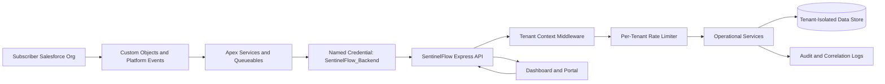

# SentinelFlow Security Review Packet

> Last updated: 2026-05-12
> Scope: AppExchange security review draft for SentinelFlow package and companion API.

## Data Flow Diagram

## Runtime Tenant Controls

All API requests under `/api/*` now require tenant context except signed billing webhooks. The API accepts `x-sf-org-id` or `x-salesforce-org-id` and validates the value as a Salesforce org id. Optional context headers are `x-sf-user-id`, `x-tenant-id`, `x-package-version`, and `x-request-id`.

Every accepted API request receives `req.context` with `tenantId`, `orgId`, `userId`, `packageVersion`, and `requestId`. Missing or invalid tenant context returns `TENANT_CONTEXT_REQUIRED`.

The input validation layer rejects unsafe request shapes before controller execution. It blocks reserved object keys such as `__proto__`, validates Salesforce-style object names and record ids, constrains common query inputs like `limit`, `startDate`, and `endDate`, and rejects any `orgId` or `tenantId` in request query/body data that conflicts with the authenticated request context.

## Rate Limit Controls

The API applies per-tenant request buckets for:

| Family | Path Signals | Default Limit |
|---|---|---:|
| Classification | `classify`, `analysis` | 60/min |
| Prediction | `predict`, `analytics` | 60/min |
| Memory | `memory` | 120/min |
| Healing | `heal`, `retry`, `sync` | 20/min |
| Default API | all other `/api/*` paths | 300/min |

Limits can be tuned with `RATE_LIMIT_CLASSIFICATION`, `RATE_LIMIT_PREDICTION`, `RATE_LIMIT_MEMORY`, `RATE_LIMIT_HEALING`, `RATE_LIMIT_DEFAULT`, and `RATE_LIMIT_WINDOW_MS`.

## Permission Matrix

| Permission Set | Objects | Apex Classes | Platform Events | Named Credential |
|---|---|---|---|---|
| `SentinelFlow_Admin` | Full access to operational objects | Admin, automation, API, portal, event publishing classes | Publish/read `Integration_Health_Event__e` | `SentinelFlow_Backend` |
| `SentinelFlow_Operator` | Create/edit incidents, read telemetry, no delete | Automation, AI, event publishing, portal classes | Publish/read `Integration_Health_Event__e` | `SentinelFlow_Backend` |
| `SentinelFlow_Viewer` | Read incidents, integration logs, audit trails | Portal and system monitor classes | Read `Integration_Health_Event__e` | None |

## OAuth and Callout Flow

1. Subscriber user authenticates through the package or dashboard using the configured Salesforce auth provider or connected app.
2. Salesforce-side automation calls the external API only through `SentinelFlow_Backend`.
3. The backend validates tenant context on every API route before controller logic runs.
4. Request ids are returned in the `x-request-id` response header and should be stored with incident, heal, prediction, and audit events.

## External Endpoints

| Endpoint | Purpose | Configuration |
|---|---|---|
| `SentinelFlow_Backend` | Package-to-backend API calls | Named Credential metadata placeholder; replace endpoint during subscriber setup |
| Stripe/Razorpay | Billing webhooks and checkout | Environment variables only |
| Salesforce Login URL | OAuth and org operations | `SALESFORCE_INSTANCE_URL` |

No secrets are stored in Custom Metadata, Apex code, static resources, or dashboard bundles.

## Data Classification

| Data | Location | Classification | Control |
|---|---|---|---|
| Salesforce org id | API headers, subscription records | Customer identifier | Required tenant context |
| User id | API headers, audit records | Customer identifier | Audit only |
| Incident details | Custom objects and API payloads | Customer confidential | Org-scoped records and tenant context |
| Billing ids | Subscription records | Confidential | Provider tokens remain server-side |
| Webhook signatures | Request headers | Secret material | Validated in memory, not persisted |

## Encryption

All package-to-backend calls must use HTTPS endpoints in the Named Credential. Backend secrets are environment variables. Subscriber org data remains in Salesforce objects unless explicitly synchronized to a tenant-isolated backend store.

## Remaining External Gates

- Register and apply the managed package namespace in the packaging org.
- Replace the placeholder `SentinelFlow_Backend` endpoint with the production endpoint.
- Run Salesforce Code Analyzer and SAST scans.
- Validate package creation and promotion from the packaging org.
