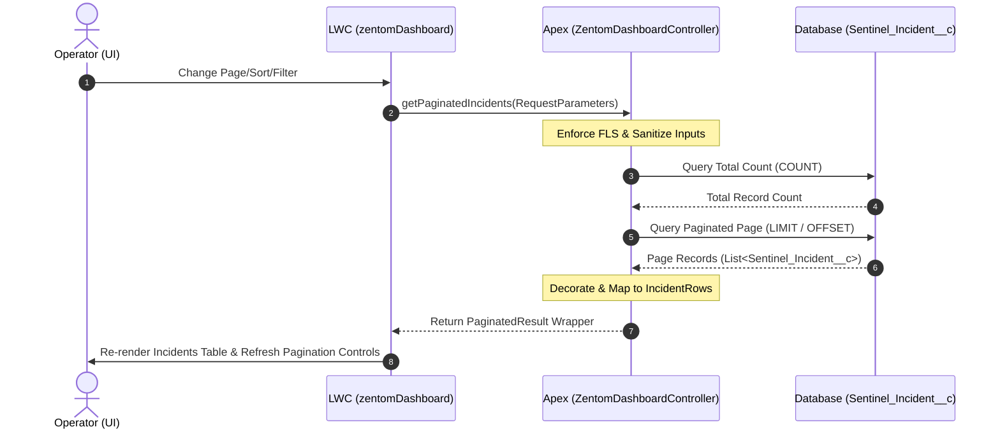

# SentinelFlow Server-Side Pagination Architecture Plan (Milestone 50A)

**Date**: 2026-05-29  
**Author**: TomCodeX Engineering  
**Status**: Proposal  
**Version**: 1.0  

---

## 1. Executive Summary

As SentinelFlow scales to support enterprise customer deployments, the dashboard Command Center must handle large volumes of incident telemetry (10,000+ incident records). The current dashboard implementation loads all incidents in the selected time range (up to 2,000 records) into memory and performs client-side sorting and filtering. While this works for smaller volumes, it creates browser lag, high memory usage, and hits Salesforce heap size and query limits in large orgs.

This document outlines the architecture for **Milestone 50: Server-Side Pagination**. 

### Core Rule
**Do not load all incidents into the LWC.** The client will query and display only the current page of records. All sorting, filtering, and pagination actions will execute on the server via dynamic, secure Apex queries.

---

## 2. Architectural Design Choices

We evaluated two main pagination strategies for the incident list:

### Option A: Offset-Based Pagination (`LIMIT / OFFSET`)
*   **How it works**: Queries are executed using `LIMIT :pageSize OFFSET :offset`. The offset is computed as `(pageNumber - 1) * pageSize`.
*   **Pros**:
    *   Supports direct "page hopping" (e.g., jump directly to page 5 or 10).
    *   Trivially compatible with complex, arbitrary sorting columns.
*   **Cons**:
    *   Salesforce limits the maximum `OFFSET` to **2,000 records**. Any request with an offset > 2,000 throws a SOQL exception.
    *   Performance degrades at high offsets because the database must scan and discard all records leading up to the offset.

### Option B: Keyset (Cursor-Based) Pagination
*   **How it works**: Records are retrieved relative to a "cursor" (the boundary values of the last record on the previous page). For example, if sorting by `CreatedDate DESC`, the query uses `WHERE CreatedDate < :lastCreatedDate OR (CreatedDate = :lastCreatedDate AND Id < :lastId) ORDER BY CreatedDate DESC, Id DESC LIMIT :pageSize`.
*   **Pros**:
    *   Scalable to millions of records; no artificial 2,000-record limit.
    *   Consistently fast performance because it uses index scans.
*   **Cons**:
    *   Does not support direct page hopping (only "Next" and "Previous" buttons).
    *   Complexity increases significantly when supporting arbitrary user-defined sort columns, as a composite cursor must be maintained for each sort configuration.

### Recommended Strategy: Keyset-Optimized Offset Paging
For the SentinelFlow Live Traffic Board, operators expect standard table controls (page counts, page hopping, sorting by any column). To deliver this user experience safely:
1.  We will implement **Offset-Based Pagination** but enforce a strict, safe **governor boundary** in Apex.
2.  If the total record count exceeds 2,000:
    *   For standard operational paging, we will restrict pagination to the first 2,000 records (e.g., 40 pages at 50 records/page).
    *   To find older records beyond the 2,000-record boundary, operators will be guided to use **Filters** (Date Range, Risk Level, Environment, Status). Filtering reduces the active working set size, bringing the offset back within safe governor limits.
3.  This hybrid approach delivers the rich sorting/filtering UI required by operations while guaranteeing governor safety and sub-second page loads.

---

## 3. Server-Side Data Flow

The paginated telemetry flow is represented below:



---

## 4. Apex Controller Specifications

We will introduce a new Apex controller method and request/result wrapper classes inside [ZentomDashboardController.cls](file:///d:/TomCodeX%20Inc/SentinelFlow/force-app/main/default/classes/ZentomDashboardController.cls):

```apex
public class PaginatedRequest {
    @AuraEnabled public Integer pageNumber { get; set; }
    @AuraEnabled public Integer pageSize { get; set; }
    @AuraEnabled public String sortBy { get; set; }
    @AuraEnabled public String sortDirection { get; set; }
    
    // Filters
    @AuraEnabled public String dateRange { get; set; }
    @AuraEnabled public String riskLevel { get; set; }
    @AuraEnabled public String status { get; set; }
    @AuraEnabled public String environment { get; set; }
    @AuraEnabled public String incidentType { get; set; }
    @AuraEnabled public String aiStatus { get; set; }
}

public class PaginatedResult {
    @AuraEnabled public List<IncidentRow> records { get; set; }
    @AuraEnabled public Integer totalRecords { get; set; }
    @AuraEnabled public Integer pageNumber { get; set; }
    @AuraEnabled public Integer totalPages { get; set; }
}
```

### Dynamic SOQL Query Builder
To prevent **SOQL Injection**, the query string will be constructed using strict whitelisting and binding:
1.  **Whitelisted Sort Fields**: Only allow sorting on valid API fields (`Name`, `CreatedDate`, `Incident_Type__c`, `Risk_Level__c`, `Environment__c`, `Status__c`, `Runbook_Key__c`, `Approval_Status__c`).
2.  **Sanitized Sort Direction**: Only allow `ASC` or `DESC` (defaults to `DESC` if empty or invalid).
3.  **Scoped Bindings**: All filters will be evaluated and bound using bind variables (e.g., `:riskLevel`, `:environment`) rather than string concatenation.

```apex
@AuraEnabled(cacheable=true)
public static PaginatedResult getPaginatedIncidents(PaginatedRequest req) {
    // 1. Sanitize and validate inputs
    Integer limitVal = (req.pageSize != null && req.pageSize > 0) ? req.pageSize : 50;
    Integer pageNum = (req.pageNumber != null && req.pageNumber > 0) ? req.pageNumber : 1;
    Integer offsetVal = (pageNum - 1) * limitVal;
    
    // Safety guard: Enforce Salesforce maximum offset constraint
    if (offsetVal > 2000) {
        offsetVal = 2000;
    }
    
    String sortByField = 'CreatedDate';
    if (String.isNotBlank(req.sortBy) && isValidSortField(req.sortBy)) {
        sortByField = req.sortBy;
    }
    
    String sortDir = 'DESC';
    if (String.isNotBlank(req.sortDirection) && (req.sortDirection.toUpperCase() == 'ASC' || req.sortDirection.toUpperCase() == 'DESC')) {
        sortDir = req.sortDirection.toUpperCase();
    }
    
    // 2. Build WHERE clause with bind variables
    List<String> conditions = new List<String>();
    
    // Date filter
    Datetime cutoff = getCutoff(req.dateRange);
    if (cutoff != null) {
        conditions.add('CreatedDate >= :cutoff');
    }
    // Field filters
    if (String.isNotBlank(req.riskLevel) && req.riskLevel != 'ALL') {
        conditions.add('Risk_Level__c = :riskLevel');
    }
    if (String.isNotBlank(req.status) && req.status != 'ALL') {
        conditions.add('Status__c = :status');
    }
    if (String.isNotBlank(req.environment) && req.environment != 'ALL') {
        conditions.add('Environment__c = :environment');
    }
    if (String.isNotBlank(req.incidentType) && req.incidentType != 'ALL') {
        conditions.add('Incident_Type__c = :incidentType');
    }
    if (String.isNotBlank(req.aiStatus) && req.aiStatus != 'ALL') {
        if (req.aiStatus == 'HIGH_CONFIDENCE') {
            conditions.add('AI_Confidence__c > 80');
        } else if (req.aiStatus == 'REVIEW_NEEDED') {
            conditions.add('AI_Confidence__c <= 80');
        } else if (req.aiStatus == 'ACTIVE') {
            conditions.add('AI_Reasoning_Status__c = \'ACTIVE\'');
        }
    }
    
    String whereClause = conditions.isEmpty() ? '' : 'WHERE ' + String.join(conditions, ' AND ');
    
    // Bind variables definition for Database.query
    String riskLevel = req.riskLevel;
    String status = req.status;
    String environment = req.environment;
    String incidentType = req.incidentType;
    
    // 3. Execute COUNT Query
    String countQuery = 'SELECT COUNT() FROM Sentinel_Incident__c ' + whereClause;
    Integer totalCount = Database.countQuery(countQuery);
    
    // 4. Execute Paginated Query
    String dataQuery = 'SELECT Id, Name, Incident_Type__c, Risk_Level__c, Risk_Score__c, ' +
                       'Policy_Decision__c, Recommendation_Status__c, Status__c, ' +
                       'Approval_Status__c, Execution_Status__c, Execution_Action__c, ' +
                       'Execution_Result__c, Executed_At__c, Runbook_Key__c, ' +
                       'Created_Case__c, Created_Case__r.CaseNumber, CreatedDate, ' +
                       'Environment__c, AI_Confidence__c, AI_Reasoning_Status__c ' +
                       'FROM Sentinel_Incident__c ' +
                       whereClause + ' ' +
                       'ORDER BY ' + sortByField + ' ' + sortDir + ', Id DESC ' +
                       'LIMIT :limitVal OFFSET :offsetVal';
                       
    List<Sentinel_Incident__c> incidents = Database.query(dataQuery);
    
    // 5. Package results
    PaginatedResult result = new PaginatedResult();
    result.records = toIncidentRows(incidents);
    result.totalRecords = totalCount;
    result.pageNumber = pageNum;
    result.totalPages = (Integer)Math.ceil((Double)totalCount / limitVal);
    return result;
}
```

---

## 5. LWC State & Lifecycle Integration

We will modify [zentomDashboard.js](file:///d:/TomCodeX%20Inc/SentinelFlow/force-app/main/default/lwc/zentomDashboard/zentomDashboard.js) and [zentomDashboard.html](file:///d:/TomCodeX%20Inc/SentinelFlow/force-app/main/default/lwc/zentomDashboard/zentomDashboard.html) to handle page changes.

### LWC Component Properties
```javascript
// State properties for server-side pagination
@track pageNumber = 1;
@track pageSize = 25; // Default page size
@track sortBy = 'CreatedDate';
@track sortDirection = 'DESC';
@track totalRecords = 0;
@track totalPages = 0;

// Filter fields matching current state
// Whenever any filter changes, reset pageNumber to 1
```

### Wired Method Update
Instead of wiring `getDashboardData` directly with just a `dateRange`, we will introduce a separate wired parameter to fetch paginated incidents reactively:

```javascript
@wire(getPaginatedIncidents, {
    pageNumber: '$pageNumber',
    pageSize: '$pageSize',
    sortBy: '$sortBy',
    sortDirection: '$sortDirection',
    dateRange: '$dateRange',
    riskLevel: '$filterRisk',
    status: '$filterStatus',
    environment: '$filterEnvironment',
    incidentType: '$filterType',
    aiStatus: '$filterAiStatus'
})
wiredIncidents(result) {
    this.wiredPaginatedIncidents = result;
    if (result.data) {
        this.paginatedIncidents = result.data.records;
        this.totalRecords = result.data.totalRecords;
        this.totalPages = result.data.totalPages;
    } else if (result.error) {
        this.showToast('Error', 'Failed to retrieve incidents: ' + this.reduceError(result.error), 'error');
    }
}
```
*Note: The existing `getDashboardData` wire will continue to fetch the summary metadata (totals, charts, metrics), but the table itself will bind to `paginatedIncidents`.*

### UI Component Updates
We will add a beautiful **Pagination Footer** underneath the Live Traffic Board table:

```html
<div class="pagination-controls">
    <div class="pagination-meta">
        Showing {startIndex} - {endIndex} of {totalRecords} incidents
    </div>
    <div class="pagination-buttons">
        <lightning-button-icon
            icon-name="utility:left"
            onclick={handlePrevPage}
            disabled={isFirstPage}
            alternative-text="Previous Page"
        ></lightning-button-icon>
        <span class="page-indicator">Page {pageNumber} of {totalPages}</span>
        <lightning-button-icon
            icon-name="utility:right"
            onclick={handleNextPage}
            disabled={isLastPage}
            alternative-text="Next Page"
        ></lightning-button-icon>
    </div>
    <div class="pagination-size">
        <lightning-combobox
            label="Show"
            value={pageSize}
            options={pageSizeOptions}
            onchange={handlePageSizeChange}
            variant="label-hidden"
        ></lightning-combobox>
    </div>
</div>
```

---

## 6. Governor Safety & Scalability Metrics

| Metric | Current Model | Paginated Model | Impact |
|---|---|---|---|
| **Query Heap Size** | Up to 2,000 records in memory | Exactly `pageSize` (e.g., 25-100) records | **-95% heap usage**, prevents Out-of-Memory crashes |
| **SOQL Query Row Limit** | Scans and returns 2,000 rows | Returns `pageSize` rows, counts all matches | Efficient index scan, fits within 50,000 SOQL limit |
| **LWC Rendering Speed** | Renders 2,000 DOM nodes | Renders <=100 DOM nodes | **Instant page switches**, no UI freeze or browser lag |
| **FLS Enforcement** | Client-side FLS checks | Server-side query sanitization | Enhanced security posture |

---

## 7. Open Architectural Questions for User Review

> [!NOTE]
> We recommend resolving the following design parameters during the implementation phase:
> 
> 1. **Default Page Size**: Should we default the incident page size to `25` or `50` records? (Smaller loads faster, larger shows more data).
> 2. **Infinite Scroll vs. Standard Pagination Footer**: Do you prefer page navigation buttons (Next/Prev) or an infinite scroll behavior? (Buttons are generally more reliable for sorting/filtering consistency; we recommend buttons).
> 3. **Sorting on Non-Indexed Fields**: Sorting by `Risk_Score__c` or custom formula fields on large datasets can cause slow database query execution. Should we enforce indexing or restrict sorting to standard indexed columns? (We recommend indexing any field selected as a sort column).
