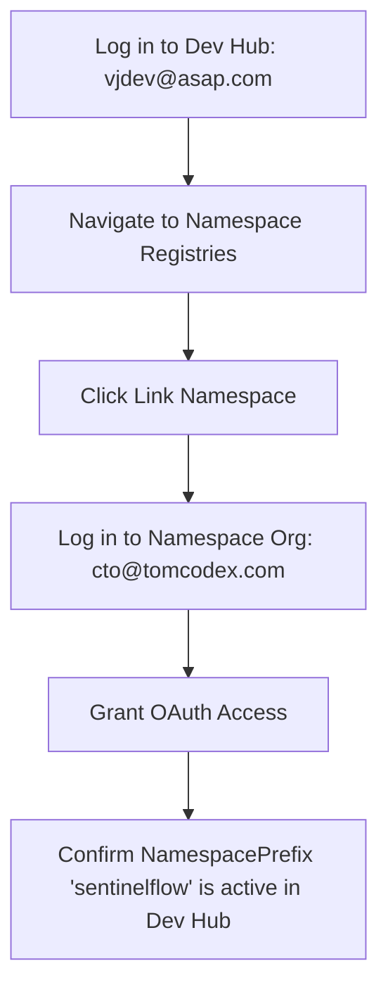

# v1.2.0 Namespace & Managed Package External Blocker Closure

This document records the verification results for Milestone 71B-10: Namespace / Managed Package External Blocker Closure. It identifies the exact environment states and outlines the final manual/external steps required to unblock the first Managed 2GP package version candidate (Milestone 71C).

---

## 1. Context & Blocker Summary

To prepare SentinelFlow + Zentom AI v1.2.0 for Salesforce AppExchange submission, the codebase must be packaged as a **Second-Generation Managed Package (Managed 2GP)**. This requires the package to be associated with a registered, active namespace.

During the verification phase, the following blocker was identified:
* **The Namespace `sentinelflow` is not linked to the Dev Hub `astrosoft`.**
* Consequently, creating a managed package with the namespace prefix `"sentinelflow"` is currently blocked at the Salesforce platform level.

---

## 2. Environment Verification Results

The following active environment registrations were verified via the Salesforce CLI:

### 2.1 Dev Hub Org Profile (`astrosoft`)
* **Alias**: `astrosoft`
* **Username**: `vjdev@asap.com`
* **Org ID**: `00DdL0000053505UAA`
* **Namespace Prefix**: `null` (un-namespaced Dev Hub)
* **Status**: `Connected`

### 2.2 Namespace Org Profile (`tomcodex-cto`)
* **Alias**: `tomcodex-cto`
* **Username**: `cto@tomcodex.com`
* **Org ID**: `00DNS00000rSAxB2AW`
* **Namespace Prefix**: `sentinelflow` (owns the target namespace)
* **Status**: `Connected`

### 2.3 Registry Linkage Query
The Dev Hub's namespace registries were queried using the following SOQL command:
```bash
sf data query --target-org astrosoft --query "SELECT Id, NamespacePrefix FROM NamespaceRegistry"
```

**Result**:
```
Total number of records retrieved: 0.
```
> [!WARNING]
> **Linkage Status: NOT LINKED**
> The target namespace prefix `sentinelflow` is owned by `tomcodex-cto` but has not yet been authorized or registered inside the `astrosoft` Dev Hub registry.

---

## 3. Step-by-Step Resolution Guide (External Blocker Closure)

Because namespace linking requires a secure OAuth handshake between the Namespace Developer Org and the Dev Hub, it **cannot** be automated via the Salesforce CLI and must be performed manually by the system administrator via the Salesforce Setup UI.

### 3.1 Setup UI Access Verification
Since the Setup Quick Find for `"Namespace Registries"` may return `"No matching items found"` depending on the org's layout or edition permissions, try navigating directly to the Dev Hub Setup page via its direct URL:

*   **Target Dev Hub setup URL**:
    `https://astrosoft2-dev-ed.develop.my.salesforce.com/lightning/setup/DevHub/home`

> [!CAUTION]
> **Access Denial Scenario**
> If navigating directly to `/lightning/setup/DevHub/home` displays an **"unavailable"** or **"no access"** error page, it confirms that this specific Developer Edition user (`vjdev@asap.com`) does not have Dev Hub setup permissions, or the registry capability is disabled by Salesforce for this environment.

---

### 3.2 Linking Handshake Workflow
If access is successful, execute the following workflow:



### Execution Steps:
1. **Log In to the Dev Hub Org**:
   * Open a browser and log in to the Dev Hub Org (`vjdev@asap.com` / `astrosoft`).
2. **Access the Namespace Registry Setup**:
   * Navigate directly to `/lightning/setup/DevHub/home` or find the **Namespace Registries** app in the App Launcher (9-dot grid icon).
3. **Initiate the Linking Handshake**:
   * Click the **Link Namespace** button. This will open a Salesforce login pop-up window.
4. **Log In to the Namespace Org**:
   * In the pop-up window, log in using the credentials for the Namespace Org (`cto@tomcodex.com` / `tomcodex-cto`).
5. **Authorize the Connection**:
   * Grant permissions for the Dev Hub to access the Namespace Org registry.
6. **Verify Registry State**:
   * Ensure that the namespace **`sentinelflow`** appears in the list of linked namespace registries with a status of **Active**.

---

## 4. Post-Linkage CLI Verification

Once the manual linking steps are completed, the administrator can verify success by running the following query in the terminal:

```bash
sf data query --target-org astrosoft --query "SELECT Id, NamespacePrefix FROM NamespaceRegistry"
```

### Expected Output:
```
Querying Data... done
┌────────────────────┬─────────────────┐
│ ID                 │ NAMESPACEPREFIX │
├────────────────────┼─────────────────┤
│ 0a0dL00000XXXXX    │ sentinelflow    │
└────────────────────┴─────────────────┘
Total number of records retrieved: 1.
```

---

## 5. Post-Blocker Execution Plan

Once the namespace registry shows the namespace prefix `sentinelflow` is successfully linked, the following packaging commands can be executed:

### 5.1 Update sfdx-project.json
The `namespace` property must be populated inside [sfdx-project.json](file:///d:/TomCodeX%20Inc/SentinelFlow/sfdx-project.json):
```json
{
  "namespace": "sentinelflow",
  "packageDirectories": [
    {
      "path": "force-app",
      "default": true,
      "package": "SentinelFlow Managed",
      "versionName": "1.2.0",
      "versionNumber": "1.2.0.NEXT"
    }
  ],
  ...
}
```

### 5.2 Create the Managed Package
Register the new second-generation managed package with the Dev Hub:
```bash
sf package create \
  --name "SentinelFlow Managed" \
  --package-type Managed \
  --path force-app \
  --target-dev-hub astrosoft
```
*Save the resulting package ID (starts with `0Ho`) and map it as `"SentinelFlow Managed"` in your `packageAliases` inside [sfdx-project.json](file:///d:/TomCodeX%20Inc/SentinelFlow/sfdx-project.json).*

---

## 6. Milestone Staging Verdict

> [!IMPORTANT]
> **Milestone 71C (First 2GP Package Version Candidate) Status: BLOCKED**
> Proceeding to 71C is strictly blocked until the external namespace linking is completed and the package is created.
