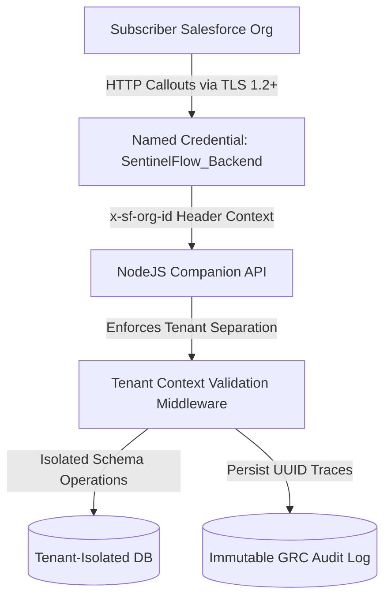

# v1.2.0 AppExchange Security Review Submission Checklist

This document serves as the official **Security Review Submission Checklist** for **SentinelFlow + Zentom AI v1.2.0**. It compiles all the security evidence, scanner reports, test environment requirements, credentials, and architectural disclosures necessary for submission to the Salesforce AppExchange Security Review Operations team.

---

## 1. Submission Overview & Profile

| Submission Field | Value | Notes |
|---|---|---|
| **Product Name** | SentinelFlow + Zentom AI | Listed as a single combined application |
| **Release Version** | v1.2.0 | Stable Enterprise Release |
| **Application Type** | Hybrid (Managed 2GP + External Web Service) | LWC UI running inside Salesforce + Companion Node.js API |
| **Package Type** | Second-Generation Managed Package (2GP) | Staged to use `sentinelflow` namespace |
| **Target Namespace** | `sentinelflow` | *Staged - pending external registry linking* |
| **Review Type** | New Application Security Review | First-time review for v1.2.0 architecture |

---

## 2. Security Architecture & Threat Vectors

Disclosures regarding endpoints, credentials, and authentication flows used by the application:

### 2.1 External Endpoints (Callout Disclosures)
All communications between the subscriber org and the companion API occur over secure protocols.

*   **Named Credential Reference**: `SentinelFlow_Backend`
    *   *Protocol*: HTTPS (TLS 1.2 or TLS 1.3 enforced)
    *   *Configuration Type*: Endpoint configuration placeholder updated at installation time.
*   **Third-Party Payments (Billing Webhooks)**:
    *   Stripe / Razorpay payment callback validation occurs purely server-side.
    *   Webhook signatures are verified in memory using SHA256 HMAC and are never stored in the database.

### 2.2 Sensitive Data Controls
*   **Secret Management**: No secrets, client secrets, password strings, private API keys, or database credentials are stored in custom metadata, Apex code, or package static resources. All backend credentials reside strictly in server-side environment variables.
*   **PII & Customer Payload Air-Gap**: Platform Events (`SentinelFlow_Dashboard_Event__e`) and prediction signals exclude raw customer data records, email bodies, and password payloads. Telemetry transfers are limited to numeric counters and system exception type strings.

---

## 3. Required Scanner Reports (SAST/DAST)

Salesforce requires clean static and dynamic vulnerability scan reports, along with false-positive explanations.

- [ ] **Salesforce Code Analyzer Report (LWC + Apex)**:
    *   *Scan Method*: Run `sf scanner run` (incorporating PMD, ESLint, Checkmarx, and RetireJS engines).
    *   *Target Directory*: `force-app`
    *   *Compliance Threshold*: Zero high/medium severity findings, or documented false positives with justifications.
- [ ] **Dynamic Web Vulnerability Scan (Companion Node.js API)**:
    *   *Scan Method*: OWASP ZAP (Zed Attack Proxy) or Burp Suite full active scan report.
    *   *Target API Endpoint*: Production NodeJS/Express API instance.
    *   *Scope*: Validation of tenant context middleware, rate limiters, payload size restrictions, and authentication headers.
- [ ] **Third-Party Dependency Audit**:
    *   *Command run*: `npm audit` on NodeJS companion API dependencies and `npm audit` on LWC package scope.
    *   *Target Status*: Zero critical or high-risk vulnerabilities.

---

## 4. Test Environments & Credentials

Salesforce Security Reviewers require access to an active, pre-configured test environment to run manual penetration tests.

- [ ] **Target QA Org**:
    *   *Type*: Partner Developer Org or Packaging Sandbox.
    *   *SentinelFlow Version Installed*: v1.2.0 Managed Package Candidate.
    *   *Instance URL*: [vjdev@asap.com Sandbox](https://astrosoft2-dev-ed.develop.my.salesforce.com)
- [ ] **User Account Credentials**:
    *   *Account 1 (Administrator Role)*:
        *   *Username*: `vjdev@asap.com`
        *   *Permission Set*: `SentinelFlow_Admin` (gives full CRUD, Named Credential setup, and metadata access).
    *   *Account 2 (Least Privilege Role)*:
        *   *Username*: `vjoperator@asap.com` (requires creation)
        *   *Permission Set*: `SentinelFlow_Operator` (gives access to view dashboard, request incident approvals, but blocks record deletes and audit log editing).
- [ ] **Test Telemetry & Data Setup**:
    *   Ensure mock signals exist on the dashboard Traffic Board.
    *   Verify that executing simulation scripts (Scenario A timeouts, Scenario B deployments) generates representative warning cards to review.

---

## 5. Sharing Model & Security Compliance Gates

Verification checks for secure coding practices on the Salesforce platform:

- [x] **Apex Class Sharing Model Enforced**:
    *   All packaged Apex classes (`ZentomDashboardController.cls`, `AutoHealExecutionService.cls`, `SentinelPredictionEngine.cls`, etc.) are declared with explicit `with sharing` or `inherited sharing` keywords to enforce user-based record access limits.
- [x] **FLS/CRUD Enforced in Database Queries**:
    *   SOQL queries are run using `WITH USER_MODE` or checked programmatically via `Security.stripInaccessible` to enforce object and field-level security.
- [x] **No Bypass Access Checks**:
    *   Verify `ZentomDashboardController.cls` does not execute queries on administrative/audit records without verifying user FLS.
- [x] **Immutable GRC Audit Log Compliance**:
    *   `Sentinel_Audit_Log__c` is configured as write-once. Field level write access is blocked for Operator roles.
- [x] **Emergency Kill Switch Verification**:
    *   Verify that toggling the custom metadata setting `Auto_Heal_Active` to `0.0` programmatically blocks all queueable executions inside `AutoHealExecutionService.cls`.

---

## 6. Submission Documentation Checklist

Prepare the following documentation links for the submission wizard:

1.  **System Architecture Blueprint**: [SentinelFlow Master Architecture Guide](file:///d:/TomCodeX%20Inc/SentinelFlow/docs/SentinelFlow_Master_Architecture.md)
2.  **Post-Installation & Setup Guide**: [SentinelFlow Post-Install Guide](file:///d:/TomCodeX%20Inc/SentinelFlow/docs/sentinelflow-post-install-guide.md)
3.  **UI/UX Remediation Report**: [v1.2.0 UI Remediation & Floating Copilot Cleanup](file:///d:/TomCodeX%20Inc/SentinelFlow/docs/v1.2.0-floating-ai-copilot-ui-remediation.md)
4.  **Compliance Mappings**: [v1.2.0 Security Compliance & Evidence Pack](file:///d:/TomCodeX%20Inc/SentinelFlow/docs/v1.2.0-compliance-evidence-pack.md)
5.  **Objection & FAQ Brief**: [AppExchange Objection Handling & FAQ](file:///d:/TomCodeX%20Inc/SentinelFlow/docs/prediction-auto-heal-demo-objection-handling.md)
6.  **Static Analyzer Justifications**: Document explaining any low-severity rules flagged by the Code Analyzer.

---

## 7. Submission Readiness Verdict

> [!IMPORTANT]
> **Security Review Submission Readiness: BLOCKED**
> While all security controls, CRUD checks, write-once audits, and documentation are completely ready, the final submission package version **cannot be generated** until the namespace registry linkage is resolved and the Managed 2GP package is created.
